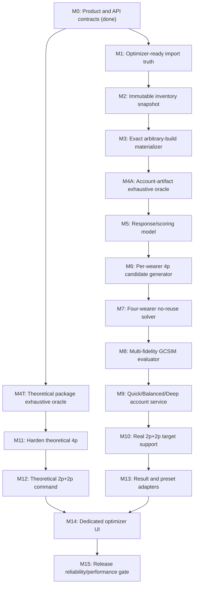

# GCSIM Account Artifact Optimizer Delivery Pipeline

Reviewed: 2026-07-23

Starting code baseline: `7a390c1`

Goal: move from the current theoretical `4p` heuristic to a user-facing GCSIM
optimizer subwindow that can return the best artifact configuration found in
the frozen account database for all four characters, with exactly five real
artifacts per character and no artifact reused.

Current delivery status: Milestone 0 was completed on 2026-07-23 in
`run_workspace/gcsim/optimizer_product_contracts.py`. Milestone 1 is next. No
later search, inventory, preset, or UI milestone was implemented as part of M0.

This document is an ordered delivery plan. Each milestone is intentionally
small enough to become one future task specification. Technical details and
current source symbols live in `GCSIM_OPTIMIZER_TECHNICAL_HANDOFF.md`.

## 1. The target is several explicit actions, not one magic button

The product split is foundational and must not be simplified away.

### Set-combination/farming view

Expose separate actions:

1. `Find best 4p set combinations`
   - inventory-independent;
   - equal abstract investment;
   - optimizes theoretical main/substats for the frozen team and rotation;
   - returns theoretical full-team top-N.
2. `Find best 2p+2p set combinations`
   - inventory-independent;
   - explicit deeper/more expensive command;
   - searches only complete `2p+2p` packages;
   - returns its own theoretical full-team top-N.

`2p+2p` must not be silently multiplied into the normal fast `4p` command.
The backend commands and cache namespaces remain distinct even if the final UI
uses adjacent buttons.

Each theoretical result row has `Use as target sets`. It copies the four target
packages into the account-artifact view without equipping or saving anything.

### Artifacts-for-target-sets view

Expose one account operation with three explicit depth actions or equivalent
clearly separate controls:

- `Quick`;
- `Balanced`;
- `Deep`.

The four target packages are explicit and editable. Each target may be one
complete `4p` or one complete unordered `2p+2p` package made from two different
set keys. The account search does not automatically test other set packages.

Depth changes time, candidate-pool, simulation, and rerace budgets only. It must
not change slot legality, silently omit a supported stat, or introduce
character-name rules. All depths return `best_found` for the actual evaluated
budget and remain cancellable.

The existing user expectation for the normal theoretical `4p` action is a hard
five-minute envelope on the reference 8-core/16-thread machine while retaining
counterintuitive stat branches. This is an acceptance target, not a current
performance claim. The exact account `Quick`, `Balanced`, and `Deep` durations
must be set from account-search benchmarks and shown as estimates; each still
has a hard deadline.

### Deliberately excluded automatic domains

- one active `2p` plus three unmatched pieces;
- `2p+1+1+1`;
- rainbow/no-active-bonus builds;
- an automatic “try every account set and every set pair” account search.

The user can still manually choose an off-meta target package and run it against
the account.

## 2. Definition of done

The final account operation is complete only when one click from a ready frozen
GCSIM team/rotation can:

1. Freeze the trusted engine, static target, team, weapons, talents, rotation,
   settings, target packages, and one immutable account inventory snapshot.
2. Search legal real five-slot builds for every wearer.
3. Select one build per wearer with twenty distinct canonical artifact ids from
   the represented account inventory.
4. Validate retained assignments as full-team GCSIM configs.
5. Return typed `best_found`, cancelled, deadline, not-ready, no-success, or
   failed output.
6. Show rank, sim DPS, uncertainty/tie state, baseline delta, target sets, stats,
   and five exact artifact cards per character.
7. Report search depth, evaluated budget, coverage, cache usage, engine/config/
   inventory identities, warnings, and staleness.
8. Allow `Save preset` per character and atomic validated `Save all presets`.
9. Never equip, overwrite a preset, or mutate account state as a search side
   effect.
10. Keep the UI responsive and allow cancellation with a valid best-so-far
    result when one exists.

No canonical artifact id may be assigned to two wearers. The accepted
content-fingerprint deduplication limitation described in Milestone 1 may
undercount an exceptionally rare exact physical twin, but it is not a blocker.

## 3. Current starting point

Already implemented and reusable:

- schema-v1 product contracts for the three separate operations, canonical
  target packages, account depth identities, terminal/progress/top-N/
  uncertainty semantics, and per-operation cache/provenance namespaces;
- a lossless common-contract adapter over the current theoretical `4p` result;
- selected runtime team/rotation to complete GCSIM config;
- real account artifact stat aggregation and set-count rendering;
- trusted engine/source/executable/catalog binding;
- exact theoretical main-stat and complete `4p` renderers;
- generic equal-investment stat-response profiles;
- complete supported cheap `4p` screen;
- recall-first survivor selection;
- bounded full-team coordinate/beam/pair composition;
- real upstream `substatOptim` finalist validation;
- ordinary simulation cache;
- CPU-bounded process scheduling, cancellation, and deadlines;
- typed DPS mean/SD/SE/iterations and extensive provenance checks;
- Artifact Browser preset storage and canonical current equipment services.

Not implemented after Milestone 0:

- trustworthy immutable canonical-account inventory snapshot;
- real five-artifact candidate generation;
- global team no-reuse;
- account search orchestration;
- concrete benchmark-derived depth preset parameters and account request factory;
- account result and preset adapters;
- theoretical or account `2p+2p`;
- optimizer UI.

The current theoretical `4p` result is also not release-reliable until
set-aware refinement, close-leader reracing, and the oracle gate are complete.

## 4. Dependency map

M5-M10 and M11-M12 are separate tracks with separate oracle harnesses in
Milestone 4. They can be developed in parallel, but their domain types,
candidates, budgets, and search-result namespaces must not be merged.

## 5. Milestone 0 — freeze product and backend contracts

Completed: 2026-07-23.

Implementation:

- `optimizer_product_contracts.py` owns the schema-v1 enums, immutable
  dataclasses, canonical JSON/SHA identities, and operation registry;
- theoretical `4p`, theoretical `2p+2p`, and account artifacts use distinct
  cache and provenance namespaces;
- account depth is required and limited to typed Quick/Balanced/Deep, while
  theoretical budgets are versioned without account depth;
- `TwoPlusTwo(A, B)` canonicalizes unordered membership and rejects `A+A`;
- terminal status, progress, top-N percentages/deltas, and uncertainty labels
  share one backend contract;
- the current `GcsimOptimizedAdvisorResult` has a lossless adapter retaining its
  original typed evidence graph.

Verification at completion: 12 focused contract tests, 471 GCSIM backend tests,
and 1324 repository tests passed. The repository run retained the two known
non-failing `CustomTooltipController.owner` teardown traces.

### Purpose

Prevent future tasks from rebuilding the optimizer around incompatible meanings
of “best,” set shape, depth, or result identity.

### Work

Define typed, versioned contracts for:

- operation:
  - theoretical `4p`;
  - theoretical `2p+2p`;
  - account artifacts for selected sets;
- search depth:
  - `Quick`;
  - `Balanced`;
  - `Deep`;
- target package:
  - `FourPiece(set_key)`;
  - canonical unordered `TwoPlusTwo(set_a, set_b)`, where
    `set_a != set_b`;
- terminal status:
  - `best_found`;
  - `cancelled`;
  - `deadline`;
  - `not_ready`;
  - `no_success`;
  - `failed`;
- frozen source simulation identity;
- progress event;
- common top-N and uncertainty semantics.

Set-package identity must include required set parameters when later supported.
`A+B` and `B+A` are the same theoretical/account target identity.
`TwoPlusTwo(A, A)` is invalid; it must never masquerade as a `2p+2p` package.

Define the cache namespace and provenance schema per operation. A theoretical
result must never collide with a real-account result.

### Acceptance gate

- Contracts serialize deterministically.
- Invalid/mixed modes fail before any GCSIM process starts.
- Account depth is required only for the real-account operation. Theoretical
  commands carry their own versioned search budget; a later UI may expose
  theoretical-specific depths only as a separate product decision.
- `2p+1+1+1` and rainbow cannot be represented as automatic target packages.
- Current `GcsimOptimizedAdvisorResult` can be adapted without losing evidence.

### User decisions that may be deferred

- final localized button labels;
- default top-N count;
- visual placement of the three depth controls.

The separation of commands itself is not deferred.

## 6. Milestone 1 — make the represented inventory optimizer-ready

### Purpose

Give the solver numerically correct artifact rows and an explicit active/
complete inventory contract. These are correctness requirements, not search
tuning.

### Current problems

1. Artiscan main-stat reconstruction uses max-level 5-star values without
   considering item level.
2. 4-star Artiscan rows are currently skipped.
3. GOOD/Artiscan `lock` and `location` are discarded.
4. Artiscan import is append-oriented and has no authoritative active inventory
   generation/completeness contract.

### Accepted known issue — do not treat as a blocker

`content_fingerprint` intentionally deduplicates the same artifact when it is
observed through account data and Artiscan. This behavior was an explicit user
requirement to prevent cross-source copies. It also means that two genuinely
distinct artifacts with completely identical content can collapse into one
canonical `artifacts.id`.

That exact-twin case is considered negligibly rare and is accepted. Do not add
an identity/multiplicity migration to this pipeline and do not block account
search on it. Reopen the policy only under a separate explicit product decision.

### Work

Add accurate main-stat progression by rarity, level, and main stat, with tests
against known values. Store or explicitly reject lock/location fields according
to the selected import contract.

Add an inventory generation model:

- generation/import snapshot id;
- complete vs partial source flag;
- invalid/skipped item counts and reasons;
- active vs historical rows;
- source reconciliation policy.

Do not delete historical/user data merely to make the optimizer query simple.

### Acceptance gate

- A 5-star item below +20 has the correct main value.
- Supported 4-star items import with correct values.
- Partial/invalid inventory cannot be presented as silently complete.
- Existing artifact/equipment/preset tests still pass.
- Existing cross-source `content_fingerprint` deduplication remains unchanged.

### Explicit non-goal

No search algorithm in this milestone.

## 7. Milestone 2 — immutable account inventory snapshot

### Purpose

Search one stable in-memory account state while the user may continue using the
application.

### Work

Create a backend-only `AccountArtifactInventorySnapshot` or equivalent. Load it
inside one short read-only SQLite transaction. Do not use the UI-oriented
`ArtifactItem` as the optimizer contract.

Every artifact record needs:

- canonical account artifact id;
- separate content identity;
- slot;
- canonical `set_uid` and ready GCSIM set key/status;
- rarity and level;
- exact main property type/value;
- exact substat types/values;
- current canonical owner when known;
- lock/protect/eligibility state when available;
- active inventory generation/source provenance;
- readiness issues.

The snapshot also needs:

- schema version;
- generation/completeness report;
- deterministic canonical SHA-256 over sorted artifacts, stats, eligibility,
  and relevant owner rows;
- selected eligibility policy;
- excluded-row counts and reasons.

Search must never query SQLite after the snapshot is frozen.

Before save/apply, recompute or validate the relevant snapshot/selected item
identities. A stale result may remain viewable but must be marked stale.

### Acceptance gate

- Equal DB contents produce the same hash independent of row order.
- Any relevant artifact/stat/owner/eligibility change changes the hash.
- UI localization, icons, and timestamps that do not affect search do not
  change it.
- Mutating the DB during a test does not mutate the in-flight snapshot.
- Missing set mapping, invalid numeric stats, unsupported rarity/level, and
  incomplete generations produce typed readiness, not exceptions or guesses.

### Policy decisions for the task specification

- whether locked items are included, excluded, or configurable;
- whether currently equipped items are always eligible;
- whether “preserve current owner” is a hard constraint or a cost preference.

The default product direction is to search all eligible account artifacts and
show required moves, not to pretend currently equipped pieces are unavailable.

## 8. Milestone 3 — exact arbitrary-build materializer

### Purpose

Turn five selected real artifacts into the exact GCSIM artifact block without
creating a preset or touching equipment.

### Work

Extract/generalize a public pure adapter from the existing paths:

- `calculate_raw_build_summary(...)`;
- `ArtifactBuildSnapshot`;
- stat normalization;
- `_ArtifactSetKeyResolver`;
- `GcsimArtifactConfigInput`;
- `build_gcsim_character_config_block(...)`.

The production search path should aggregate from the immutable in-memory
snapshot, not execute a SQLite query for every candidate. Keep the existing DB
summary as a parity oracle in tests.

Produce:

- exact five ids by slot;
- set counts;
- normalized raw artifact stat totals;
- GCSIM `add stats`;
- GCSIM `add set` lines;
- a preset-ready `ArtifactBuildSnapshot`;
- compiled artifact-block/config hash;
- warnings/readiness.

Set effects must not be manually added into stat totals. GCSIM receives set
counts and applies modeled effects.

Add a full-team config replacer that changes only the four artifact blocks in
the already frozen selected-team config. Character, weapon, talents, options,
rotation, target, and engine identity must remain unchanged.

### Acceptance gate

- A known current-equipped/preset build materializes identically through the old
  DB-backed and new snapshot-backed paths.
- All five positions and every normalized stat type have parity tests.
- Two different id assignments with identical stats/set counts compile to the
  same simulation hash but remain separate id witnesses.
- Missing/duplicate positions and unknown set/stat mappings fail closed.
- Materialization performs no DB writes.

## 9. Milestone 4 — independent reduced exhaustive oracle harnesses

### Purpose

Create correctness references before implementing pruning. Without them,
candidate-generation mistakes will look like “GCSIM noise.” Account artifacts
and theoretical equal-investment packages have different domains and require
independent harnesses.

### M4A — account-artifact oracle

Build a tiny synthetic inventory where exhaustive enumeration is practical.
The account oracle must:

- enumerate legal five-slot wearer builds under one target package;
- enumerate joint four-wearer assignments;
- enforce canonical artifact-id uniqueness;
- support deterministic surrogate objectives and mocked GCSIM results;
- optionally use a tiny real GCSIM fixture;
- report the exact stage where a proposed optimizer would remove the winner.

Required fixtures:

- 4p offpiece in each of all five slots;
- `2p+2p` that is optimal only as a complete four-piece interaction;
- one highly contested artifact;
- duplicate use of one canonical artifact id;
- crit cap;
- ER/burst threshold;
- HP/healing/support threshold;
- EM reaction owner;
- DEF scaler;
- unusual main stats;
- statistically tied candidates;
- simulator-identical id witnesses.

### M4T — theoretical package oracle

Build a separate tiny theoretical domain where exhaustive enumeration over set
packages, carried main-stat layouts, abstract equal-investment allocations, and
four-wearer package combinations is practical. It must cover:

- complete `4p` packages;
- complete unordered `2p+2p` packages with two different set keys;
- set bonuses that change the best main-stat or substat allocation;
- crit caps, ER thresholds, EM ownership, HP/DEF scalers, and support-only set
  effects;
- coordinated team changes that cannot be ranked by adding wearer-local DPS;
- effect-equivalent aliases that share a simulation but remain displayable.

The harness must compare every pruning stage against the exhaustive winner and
record survivor recall, regret, and the exact removal stage independently from
the account-artifact oracle.

### Acceptance gate

- M4A exhaustive counts are independently hand-checkable on the smallest
  account fixtures.
- All-different violations are impossible in returned M4A results.
- M4T exhaustively covers its reduced `4p` and distinct-set `2p+2p` domains.
- Both harnesses record survivor recall and regret per stage.
- They can test account candidate/joint solvers and theoretical package search
  independently without launching the production UI.

### Explicit non-goal

The oracle is not the production search on the full account.

## 10. Milestone 5 — rotation-conditioned response/scoring model

### Purpose

Give the real-build generator a cheap ranking signal without pretending the
theoretical substat vector is an exact artifact target.

### Work

For each wearer and selected target package:

1. Build target-set-aware reference states across retained legal main-stat
   layouts. Do not derive all real candidates from one sands/goblet/circlet
   choice; include generic legal directions and main-stat regions actually
   present in the frozen account.
2. Run upstream optimization for retained reference layouts and use each final
   allocation only as one seed/reference.
3. Run controlled one-roll and multi-scale stat perturbations through the full
   frozen team rotation.
4. Preserve multiple response regions when behavior is nonlinear.
5. Identify threshold regions such as ER/burst availability, crit/Fav, HP
   support caps, or healing-to-team conversion.
6. Produce several bounded scorer branches rather than one permanent weight
   vector when the response is mixed.

Approximate labels such as `flat/set-only`, `threshold`, `damage`, and `mixed`
may allocate search budget, but must be derived from this frozen simulation.
They are not static character roles.

The scorer should be injectable into candidate generation and versioned in cache
identity. It may use linearized roll value locally, but final retained team
assignments still require whole-team GCSIM.

### Acceptance gate

- No character-name conditions.
- Furina-like mixed fixtures retain both support and damage branches when the
  rotation makes both relevant.
- An unexpected EM/EM/EM or other unusual main-stat branch can survive without
  a character-name exception.
- Bennett-like flat/support fixtures reduce wasted damage-stat candidates
  without dropping required ER/HP/healing/set branches.
- One zero derivative does not remove a stat across an untested threshold.
- Euclidean distance to one optimized vector is not the final rank.
- Oracle trace shows where each retained scoring branch contributes recall.

## 11. Milestone 6 — per-wearer real `4p + offpiece` candidates

### Purpose

Generate a bounded, diverse pool of complete legal five-artifact builds for one
wearer and one explicit `4p` target.

### Work

Index the frozen inventory by slot, set, main stat, rarity, and eligibility.
Generate complete builds under:

- exactly one item per slot;
- at least four pieces of the target set;
- any fifth off-set or same-set item;
- every possible free/offpiece slot;
- exact physical item ids.

Use set-count dynamic programming, branch-and-bound, beam search, Pareto
frontiers, or a measured hybrid. Do not independently pick “best set pieces”
and then replace the weakest one.

Retain diversity across:

- scorer/threshold region;
- main-stat pattern;
- offpiece slot;
- set-count shape;
- contested artifact ids;
- current-equipment seed;
- raw DPS/stat leaders and uncertain candidates.

The generator accepts an injected scoring model and explicit budget. It does not
launch GCSIM itself.

### Acceptance gate

- Exact parity with the reduced single-wearer oracle.
- All five offpiece fixtures pass.
- Every result has five distinct ids and correct slots/set counts.
- A much stronger off-set goblet can change the free slot correctly.
- Pool order is deterministic for equal scores.
- Coverage/provenance reports explain why candidates were retained or pruned.
- Full-account runtime/memory is measured before fixing default pool sizes.

## 12. Milestone 7 — four-wearer global no-reuse solver

### Purpose

Select one build per wearer without wasting contested artifacts through greedy
character order.

### Work

Create a joint state containing four complete wearer builds. Enforce:

- one build per wearer;
- no canonical stored artifact id used twice;
- the frozen target package for every wearer;
- frozen inventory and simulation identity.

Recommended bounded hybrid:

1. Seed with current equipment when legal, strong diverse per-wearer builds, and
   conflict-repaired combinations.
2. Solve the bounded candidate-pool all-different problem exactly where
   practical.
3. Explore one-build changes, artifact swaps, offpiece moves, and coordinated
   two- to four-build conflict repairs.
4. Request pool enrichment when a contested id blocks promising branches.
5. Preserve diversity by response region, set shape, offpiece slots, and
   contested-id pattern.

Per-wearer surrogate values order proposals. They do not define final team DPS.

Return deterministic best-so-far joint states plus a complete trace of
evaluated/pruned/conflicting assignments.

### Acceptance gate

- Exact parity with the reduced four-wearer oracle.
- No greedy wearer-order dependence.
- The contested-id fixture assigns the strong item to the team-optimal wearer.
- One canonical artifact id can never be assigned to two wearers.
- Cancellation returns a valid disjoint best-so-far state when one exists.
- Pool exhaustion vs budget exhaustion are distinguishable.

## 13. Milestone 8 — multi-fidelity whole-team GCSIM evaluator

### Purpose

Spend expensive simulations only on promising joint assignments while keeping
final ranking tied to real team DPS.

### Work

Add an account-domain evaluation adapter over the existing ordinary scheduler:

1. Materialize exact four-wearer real artifact configs.
2. Deduplicate simulator-identical configs while retaining all id witnesses.
3. Run low-iteration ordinary simulations for broad recall.
4. Retain top, uncertain, threshold-diverse, and structurally novel assignments.
5. Rerun finalists at higher iterations.
6. Rerace overlapping leaders adaptively until the budget/deadline is exhausted.

The simulation-result cache identity must include only inputs that can change
the simulator output:

- evaluator/cache schema version;
- trusted engine binding;
- exact compiled config hash, which already captures the materialized team,
  rotation, static target, sets, and stats;
- simulation options, fidelity/iterations, seed policy, and worker-sensitive
  execution semantics where applicable.

It intentionally excludes inventory snapshot identity, artifact ids, target
aliases, and scoring/search presets when those do not change the compiled
config. Where multiple assignments compile identically, one simulation result
may serve all of them.

Assignment/search-result provenance is separate and must include:

- operation and result schema versions;
- frozen source request identity;
- inventory snapshot hash;
- four canonical target packages;
- all twenty canonical artifact ids;
- compiled config hash used by each witness;
- scoring/search/depth preset versions and evaluated budget.

A simulation-cache hit never permits returning an assignment witness from a
different snapshot or request.

### Acceptance gate

- Cached and uncached results are semantically identical.
- Relevant source changes invalidate cache.
- Partial/cancelled outputs are never cached as success.
- Close candidates receive higher-fidelity reraces.
- Tie/within-noise status comes from recorded uncertainty, not a display
  rounding heuristic.
- Candidate/stage/overall deadlines and CPU sums remain bounded.

## 14. Milestone 9 — account orchestrator and depth presets

### Purpose

Create the backend service the future UI can invoke for selected `4p` targets.
Its typed package boundary is extension-ready, but `2p+2p` becomes supported
only in Milestone 10.

### Work

Build a request factory and session that owns:

- frozen selected-team/rotation/static-target preparation;
- trusted engine and inventory preflight;
- four explicit `FourPiece` target packages;
- response models;
- per-wearer candidate generation;
- joint solver;
- GCSIM screening/final validation;
- persistent cache;
- progress/current leader;
- cancellation and deadlines;
- final typed result.

Define versioned `Quick`, `Balanced`, and `Deep` presets over:

- response probes;
- per-wearer pool limits/diversity quotas;
- joint states/mutations/rounds;
- low/high simulation iterations;
- finalist and close-leader reraces;
- total wall time and CPU budget.

All presets search the same supported legal domain. A deeper preset expands
budgets and evidence; it does not unlock correctness that Quick intentionally
lies about.

The session must run outside the UI thread and reserve at least one logical CPU
under Auto.

### Acceptance gate

- One call accepts a prepared ready team and four `FourPiece` targets.
- A `TwoPlusTwo` target returns a controlled unsupported/not-ready result until
  Milestone 10, never an accidental partial search.
- All terminal states are typed and carry coherent partial evidence.
- Progress includes stage, completed/planned work, elapsed/remaining budget,
  cache hits, and current best when available.
- Cancel latency is measured and does not freeze the UI.
- Preset values are generated from one central versioned registry.
- Quick meets its benchmark-frozen p95 time target or remains clearly
  experimental until it does.

### Do not do yet

No preset writes or UI in this milestone.

## 15. Milestone 10 — real selected-target `2p+2p`

### Purpose

Allow the account operation to honor a manually selected or theoretical
`2p+2p` target.

### Work

Generalize the per-wearer generator from one set-count constraint to:

- at least two pieces of canonical set A;
- at least two pieces of canonical set B;
- canonical set A and set B must be different keys;
- one free item;
- exactly one item per slot;
- every legal slot ownership arrangement.

`A+B` and `B+A` must canonicalize to one target. The account generator must not
collapse different concrete set names merely because their 2p effects are
simulator-equivalent; their real artifact inventories differ.

Reuse the same joint no-reuse solver and GCSIM evaluator after candidate
materialization. Keep separate generator metrics so the cost of `2p+2p` is
visible.

### Acceptance gate

- Exact parity with reduced `2p+2p` oracles.
- The best pair may require locally non-best pieces from both sets.
- The free slot changes correctly when a strong off-set item exists.
- No duplicate A/B ordering in requests, cache, or results.
- `TwoPlusTwo(A, A)` is rejected by the request contract.
- `2p+1+1+1` and rainbow remain unrepresentable.

## 16. Milestone 11 — make theoretical `4p` a product

### Purpose

Turn the current executable heuristic into the first reliable set-combination
button.

### Work

Add:

- set-aware response and main-layout refinement for retained branches;
- cheap roll exchange/redistribution around set bonuses, caps, and thresholds;
- dynamic finalist allocation from measured remaining time;
- persistent finalist cache;
- adaptive high-iteration rerace for close leaders;
- complete progress/current-best events;
- user-facing percent, baseline delta, uncertainty, and tie semantics;
- versioned theoretical budget presets if needed;
- oracle/adversarial recall traces.

Parameterized sets such as Husk require explicit frozen parameter variants and
display labels. Continue excluding them fail-closed until that policy exists.

### Acceptance gate

- The theoretical oracle gate in the technical handoff passes.
- The normal theoretical `4p` command meets the existing five-minute p95 target
  on the reference machine or remains explicitly experimental.
- No unsupported/missing branch is treated as a loss.
- Top-N is stable enough under rerace to support percent/tie display.
- Cache resume and cancel are proven.
- Result wording says theoretical equal investment and static target.
- The command is still explicitly `4p`.

## 17. Milestone 12 — separate theoretical `2p+2p` command

### Purpose

Implement the second set-combination button without exploding the default `4p`
domain.

### Work

Build a complete modeled 2p capability/signature catalog. For theoretical
equal-investment search only:

- canonicalize unordered pairs;
- require two different concrete set keys and reject `A+A`;
- collapse exact simulator-equivalent 2p effect signatures for simulation;
- retain all equivalent concrete names for display;
- preserve conditional/parameterized effects as distinct;
- exclude incomplete/unmodeled/parameter-unresolved effects.

Generalize the theoretical search state from a hardcoded `FourPieceSetState` to
a complete package state. Reuse response, survivor, team-composition, finalist,
cache, progress, and rerace infrastructure through explicit package interfaces;
do not bolt a pair string into the `4p` type.

Run this as a separate command/cache namespace with its own measured budget and
warning. It may be materially slower than `4p`.

### Acceptance gate

- Complete pair-domain coverage is auditable.
- A/B ordering does not duplicate work.
- Same-set `A+A` pairs are absent from the domain and rejected at the boundary.
- Effect-equivalent theoretical pairs simulate once but display aliases.
- Conditional/parameterized pairs are not incorrectly collapsed.
- Reduced theoretical `2p+2p` oracle gate passes.
- UI can invoke it independently from `4p`.

## 18. Milestone 13 — result and preset persistence adapters

### Purpose

Convert optimizer evidence into useful account-facing output without mutating
equipment.

### Account result fields

At minimum:

- operation/depth/status/rank;
- absolute sim DPS, baseline delta, percent of best validated found result;
- DPS SE/iterations and tie/uncertainty label;
- source config, rotation, target, engine, inventory, target-package, budget,
  and result hashes;
- coverage, cache, timing, and stop reason;
- for each wearer:
  - stable character id and GCSIM key;
  - five canonical stored artifact ids by position;
  - set counts and active package;
  - raw/normalized/GCSIM stat totals;
  - current owner/move warnings;
  - preset-ready snapshot.

### Preset service

Reuse `artifact_builds`, `artifact_build_slots`, and
`artifact_build_targets`. Add a backend service that:

- validates snapshot freshness and all selected ids;
- validates no cross-row duplicates;
- creates one character-targeted preset;
- creates all four presets atomically in one SQLite transaction;
- uses deterministic, readable, collision-safe names;
- never overwrites without an explicit later user action;
- stores optimizer provenance in notes or a dedicated typed result store if
  approved.

`Save preset` and `Save all presets` are explicit user actions after search.

### Acceptance gate

- Preview/search performs zero writes.
- Per-character save creates exactly one correct five-slot preset.
- Save-all is all-or-nothing.
- A stale/missing/changed artifact blocks save with a controlled report.
- Saving does not equip artifacts.
- Presets remain valid Artifact Browser presets and carry character targets.

### Later, separate task

Atomic team equip may be added after preview/save. It requires one transaction,
full 20-id validation, conflict preview, and rollback. Do not compose four
existing single-character UI apply calls.

## 19. Milestone 14 — dedicated GCSIM optimizer subwindow

### Purpose

Expose the backend without interfering with the parallel PvP/AppShell work.

### Placement

Implement a dedicated subwindow/overlay inside the existing GCSIM workspace.
Keep code under `ui/gcsim_browser/` and optimizer-specific modules. Do not
refactor `ui/app_shell.py` in this track while the PvP UI work is active.

### Required views and controls

`Set combinations / farming`:

- separate `Find best 4p` action;
- separate `Find best 2p+2p` action;
- top-N rows with DPS, percent/delta, tie/noise, sets, mains, abstract stats;
- `Use as target sets`.

`Artifacts for target sets`:

- four editable target package controls;
- visible `4p` vs `2p+2p` shape;
- separate `Quick`, `Balanced`, and `Deep` actions/controls;
- CPU budget/Auto;
- progress, elapsed/estimate, cache, current best;
- responsive cancel;
- top account assignments;
- one row per character with five artifact cards, stats, sets, move conflicts;
- `Save preset` per row and validated `Save all presets`.

### State boundary

The optimizer reads/freeze-copies the existing Browser team, rotation, target,
and settings. It does not create a second team/rotation owner. If live source
state changes, the old result becomes visibly stale; it is not silently
relabelled as current.

### Acceptance gate

- Backend work never runs on the UI thread.
- Cancel remains usable under full CPU load.
- Switching/closing the window does not orphan a process.
- Separate commands and result claims are visually unambiguous.
- Unsupported GCSIM entities and incomplete inventory show readiness, not a
  broken empty result.
- No AppShell/PvP regression.

## 20. Milestone 15 — reliability, performance, and release gate

### Correctness

Run:

- all optimizer unit suites;
- artifact import/storage/equipment/preset suites;
- reduced exhaustive oracle corpus;
- adversarial stat/set/team fixtures;
- full repository suite;
- real-engine supported-team smokes.

Account-specific requirements:

- exact slot and set legality;
- twenty distinct canonical artifact ids from the represented inventory;
- every offpiece position;
- `2p+2p`;
- contested item allocation;
- stale snapshot behavior;
- preset transaction rollback;
- cancel/deadline/cache equivalence.

### Reliability

Record:

- oracle top-five recall;
- best-DPS regret;
- maximum miss;
- stage where winners are lost;
- tie/rerace stability.

Do not label the feature reliable until the technical handoff's initial
`95-99%` top-five recall, `<=1%` regret, no miss over `2%`, and adversarial
fixture targets pass or are deliberately revised with evidence.

### Performance

Benchmark by:

- inventory size;
- target shape (`4p`, `2p+2p`);
- depth preset;
- cold/warm cache;
- CPU budget;
- supported representative rotations.

Record p50/p95 time, peak memory, CPU utilization, process count, cache hits,
simulation counts, cancellation latency, and UI responsiveness. Verify Auto
reserves one logical CPU.

If theoretical `4p` misses its five-minute p95 target, or account Quick misses
its separately frozen p95 target, keep that command experimental and use oracle
traces to optimize the responsible stage. Do not hide the miss by hardcoding
characters or removing supported stat directions.

### Release output

Produce one versioned benchmark/reliability report and freeze the preset registry
used by the shipped UI.

## 21. Recommended future task packets

The user can give one task specification per packet:

1. **Product and backend contracts**
   - COMPLETE: Milestone 0.
2. **Inventory readiness**
   - NEXT: Milestone 1 only.
3. **Snapshot and materializer**
   - Milestones 2-3.
4. **Oracle foundations**
   - Milestone 4A for account artifacts and Milestone 4T for theoretical
     packages; these may be separate task specifications.
5. **Single-wearer account search**
   - Milestones 5-6, `4p` only.
6. **Team no-reuse**
   - Milestone 7.
7. **Account GCSIM race and depths**
   - Milestones 8-9.
8. **Account `2p+2p`**
   - Milestone 10.
9. **Theoretical `4p` product hardening**
   - Milestone 11.
10. **Theoretical `2p+2p` command**
   - Milestone 12.
11. **Result/preset integration**
    - Milestone 13.
12. **Optimizer subwindow**
    - Milestone 14.
13. **Release gate**
    - Milestone 15.

Do not combine inventory readiness, the joint solver, and final UI into one
task. Each has an independent correctness gate, and a numeric/import/snapshot
readiness failure must not be debugged as a search-ranking issue.

## 22. What to read before each track

All optimizer work:

- `GCSIM_OPTIMIZER_TECHNICAL_HANDOFF.md`;
- `GCSIM_ENGINE_INTEGRATION_PLAN.md`, current status and optimizer section;
- `STAT_NORMALIZATION.md`;
- `TESTS.md`.

Inventory/preset work:

- `ACCOUNT_SQLITE_STORAGE.md`;
- `ACCOUNT_EQUIPMENT_STATE_DESIGN.md`;
- `ARTIFACT_BROWSER_EQUIPMENT_UX.md`;
- `DATA_RUNTIME_BOUNDARIES.md`.

UI work:

- current GCSIM Browser contract in `GCSIM_ENGINE_INTEGRATION_PLAN.md`;
- `APP_SHELL_WORKSPACE_PLAN.md`;
- active PvP/AppShell concurrency warning in `TODO.md`.
