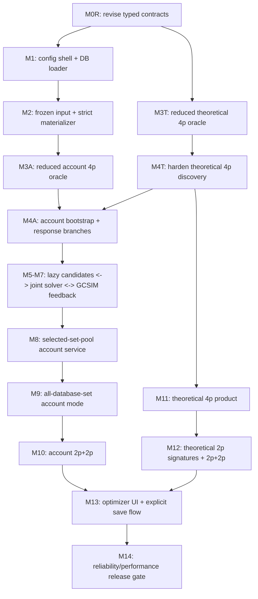

# GCSIM Artifact Optimizer Delivery Pipeline

Reviewed: 2026-07-28

Theoretical mechanics baseline: `7a390c1`

Superseded product-contract draft baseline: `ef85de3`

Goal: deliver a rotation-specific optimizer that can either compare theoretical
set packages at equal investment or search the shared artifact database for one
legal five-piece build per member of a full four-character team, with no
artifact reused.

This is the authoritative implementation order. Current mechanics and source
boundaries live in `GCSIM_OPTIMIZER_TECHNICAL_HANDOFF.md`.

## 1. Accepted product modes

There are three user-facing search modes.

### 1.1 Account: selected set pools

For each of the four wearers the user selects a non-empty pool of concrete sets
to test. Selecting one set is the simple/single-set case; selecting several sets
does not create a different backend mode.

The M13 UI defaults each pool from the active set lines in the already
prepared source GCSIM config. The user may edit the pools before search. This
prefill does not read current-equipment tables and does not make the source
artifact stats a baseline.

For a wearer pool `L`, the legal package domain is:

- `4p(S)` for every `S` in `L`;
- when `include_2p2p` is enabled, every canonical unordered pair
  `2p(A)+2p(B)` where `A != B` and both keys are in `L`.

### 1.2 Account: all eligible database sets

The optimizer derives each wearer's set domain from concrete, GCSIM-modeled
sets that can actually be assembled from eligible artifacts in the frozen
database input.

This mode must aggressively avoid materializing and simulating obviously losing
real builds. The pruning is rotation-conditioned and evidence-backed; it is not
a static character/set tier list and is not a raw Crit Value cutoff.

### 1.3 Theoretical: equal-investment set combinations

This mode ignores the account inventory. It compares full-team set/main-stat
states under the same versioned abstract investment standard and the exact
frozen team, rotation, target, and engine.

The best validated row is `100%`. Every other percentage is
`candidate_dps / best_dps * 100`, with absolute sim DPS and uncertainty/tie
evidence beside it. This is a relative top under equal standards, not an
account-build baseline.

### 1.4 Cross-cutting `2p+2p` flag

For account requests, `include_2p2p` adds complete distinct-set `2p+2p`
packages in both selected-pool and all-database-set scopes. It does not replace
`4p`, enable one lone `2p`, or permit rainbow builds. Theoretical `4p` and
theoretical `2p+2p` are separate typed/cache operations and reject the account
flag. A later UI checkbox is only a convenience that dispatches the matching
operation; it does not merge identities.

### 1.5 No speed modes yet

`Quick`, `Balanced`, and `Deep` are not accepted product modes at this stage.
First build a correct quality-first algorithm, measure it, and inspect oracle
recall/regret. User-facing speed/quality modes may be designed afterward.

Cancellation, CPU limits, and an external safety deadline remain mandatory.
Internal work plans and budgets must be versioned, but they are not UI mode
names.

## 2. Frozen product decisions

- The account optimizer reads every row in shared SQLite `artifacts` plus every
  matching `artifact_substats` row.
- It never reads JSON or invokes Artiscan/GOOD/HoYoLAB importers.
- It never filters database membership by import source, batch, timestamp,
  equipment, preset, owner, lock, or location.
- `artifacts.id` is the real allocation identity.
- Stored rarity, level, main-stat value, and substat values are used exactly.
  A `+0` artifact remains `+0`; account search never projects upgrades or future
  rolls.
- The immutable all-row copy/hash is only one calculation's input identity. It
  is not an import snapshot, generation, or second inventory database.
- Default search eligibility is valid 5-star artifacts only.
- A 4-star artifact is admitted only by an explicit request rule:
  - a deliberately selected 4-star-only set may enable that set's 4-star pieces
    for that wearer/package; and/or
  - an explicit per-wearer artifact-ID allowlist/pin may enable a particular
    4-star piece, including an offpiece.
- A malformed artifact is frozen and reported but marked ineligible. It does
  not fail the whole run while another complete legal team can still be built.
- A row with zero substats is valid.
- `content_fingerprint` deduplication has already happened before optimization.
  The accepted rare exact-twin undercount is not an optimizer task.
- All account results cover exactly four wearers and five filled positions per
  wearer, with twenty globally distinct artifact IDs.
- Canonical real-build identity is the ordered `slot -> artifact_id` mapping.
  Offpiece/free-slot labels and set-count shape are derived metadata.
- Five pieces of one set are one legal `4p` build, not five duplicated
  free-slot variants.
- `3A+2B` and `2A+3B` are legal realizations of canonical unordered `A+B` and
  are not duplicated by choosing which matching piece is called "free."
- Parameterized theoretical sets use pinned/default GCSIM behavior and record
  that state. Arbitrary caller-supplied theoretical set parameters are not an
  implemented M11 contract; add a separate typed, engine-validated contract if
  that product need is introduced later.
- Account output currently ranks by absolute whole-team sim DPS plus
  uncertainty. It has no original-build baseline delta and no required percent
  comparison.
- Search is read-only. It never equips artifacts and never saves presets.
  Persistence is reached only by a separate explicit M13 save action after a
  successful account result.

## 3. Source config and database are different inputs

The optimizer is launched from an already ready GCSIM team/rotation/config
context. It does not need a second team builder.

The prepared config owns:

- four characters and their stable identities;
- weapons, levels, talents, constellation/options;
- rotation;
- static target and simulation options;
- four artifact blocks that are replaceable optimizer input.

For every candidate, the optimizer converts the selected five real artifacts
per wearer into exact GCSIM stats/set lines and replaces all four artifact
blocks. Character, weapon, talent, option, rotation, target, and engine
semantics remain unchanged.

The source artifact blocks may prefill the M13 selected-set controls. They
must then be removed from the calculation shell. Their stats:

- are not account database membership;
- are not current-equipment ownership;
- are not used as a scoring baseline;
- must not be added to candidate artifact stats.

The artifact database separately owns the physical candidates. The optimizer
does not query current-equipment or preset tables to reconcile the two.

## 4. Current implementation status

Implemented and reusable:

- native theoretical `4p` and engine-derived theoretical `2p+2p` product
  services, with the legacy experimental advisor retained only as a
  compatibility component;
- trusted engine/source/executable/catalog binding;
- static-target validation;
- legal theoretical main-stat rendering;
- generic stat-response probes;
- complete cheap `4p` package screening in the old default domain;
- bounded full-team composition;
- upstream `substatOptim` finalist validation;
- ordinary simulation scheduling, cache, deadlines, and cancellation;
- schema-v4 Milestone 0R product contracts and `.v4` per-operation
  cache/provenance namespaces:
  - selected-set-pool/all-database-set account scope;
  - typed wearer, set, source, database, request, evaluation, and work-plan
    identities;
  - explicit 4-star overrides and `include_2p2p`;
  - required account 4x5 witness/global uniqueness;
  - typed issues/replacements/counters and operation-specific ranking fields;
  - deterministic request/progress/result parsing and canonical round trips;
  - theoretical 4p compatibility projection with retained in-process evidence.
- Milestone 1 prepared-config shell, all-row read-only database input, typed
  validation, and 5-star/default plus explicit 4-star eligibility;
- Milestone 2 immutable run input, strict arbitrary-five-ID/full-team
  materializer, and separate physical/simulation identities;
- Milestone 3 independent reduced exhaustive account/theoretical `4p` oracles,
  strict accidental-full-domain limits, simulator-identical witness grouping,
  and future pruning-stage winner-survival audit.
- Milestone 4 set-aware database-reachable main-layout domains, exact
  equal-investment multi-scale response probes, branch audit traces, and the
  coupled-EM safeguard.
- Milestone 5 lazy exact per-wearer real `4p` candidate streams, shape/feature
  retention, threshold feasibility, and physical conflict-repair shadows.
- Milestone 6 global all-different proposal solving.
- Milestone 7 iterative whole-team GCSIM feedback.
- Milestone 8 quality-first reference anchors and the selected-set-pool
  read-only account service with native typed account results.
- Milestone 9 all-database-set account search, Milestone 10 account `2p+2p`,
  Milestone 11 theoretical `4p`, and Milestone 12 strict engine-derived
  theoretical `2p+2p`, including pair-aware layout/response evidence.

Milestone 13 is implemented through a dedicated GCSIM Browser optimizer panel,
worker/session adapter, and explicit preset-save boundary. The wiring is narrow:
AppShell only supplies the already selected team, rotation, database path, and
energy setting and does not own optimizer mechanics.

The old schema-v1 draft is rejected rather than treated as persisted production
data. Milestones 0R-13 are complete. Milestone 14 is in progress and the release
gate is not yet passed.

Local database audit on 2026-07-26:

- 520 artifacts and 2068 substat rows;
- 513 5-star, 6 4-star, and 1 2-star artifact;
- no missing set UID, slot, main-stat type, or main-stat value;
- one zero-substat artifact, which is the 2-star row and is valid data.

The eligibility/error path is still required even though the current database
has no missing main stat.

## 5. Dependency map


```mermaid
flowchart TD
    M0R["M0R: revise typed contracts"] --> M1["M1: config shell + DB loader"]
    M1 --> M2["M2: frozen input + strict materializer"]
    M2 --> M3A["M3A: reduced account 4p oracle"]
    M0R --> M3T["M3T: reduced theoretical 4p oracle"]

    M3T --> M4T["M4T: harden theoretical 4p discovery"]
    M3A --> M4A["M4A: account bootstrap + response branches"]
    M4T --> M4A

    M4A --> LOOP["M5-M7: lazy candidates <-> joint solver <-> GCSIM feedback"]
    LOOP --> M8["M8: selected-set-pool account service"]
    M8 --> M9["M9: all-database-set account mode"]
    M9 --> M10["M10: account 2p+2p"]

    M4T --> M11["M11: theoretical 4p product"]
    M11 --> M12["M12: theoretical 2p signatures + 2p+2p"]

    M10 --> M13["M13: optimizer UI + explicit save flow"]
    M12 --> M13
    M13 --> M14["M14: reliability/performance release gate"]
```

Milestones 5-7 are intentionally a loop. A surrogate solver cannot declare the
team-optimal contested assignment before whole-team GCSIM feedback exists.

## 6. Milestone 0R - revise typed, versioned backend contracts (complete)

### Purpose

Replace the now-superseded schema-v1 product semantics before later account code
depends on them.

### Work

Keep explicit backend operation kinds:

- theoretical `4p`;
- theoretical `2p+2p`;
- account artifacts.

Add account scope:

- `selected_set_pools`;
- `all_database_sets`.

Add typed request fields for:

- exact four-wearer identity:
  - team slot;
  - stable account character ID;
  - GCSIM character key;
- source simulation/config/rotation/target/engine identity;
- per-wearer selected concrete `set_uid` pools when applicable;
- `include_2p2p`;
- explicit 4-star set/ID eligibility overrides;
- per-wearer account minimum-stat constraints in
  `stat_space=static_build_contribution`: normalized main/sub stats from exactly
  five artifacts plus only engine-proved unconditional static 2p set stats for
  the active package;
- versioned internal quality-first work plan;
- `artifact_database_input_sha256` for account operations.

Replace ambiguous set strings with an engine-bound set reference carrying:

- concrete database `set_uid`;
- validated GCSIM set key;
- active catalog/engine binding.

The current mapping hypothesis is case-normalized/lowercase `set_uid`, but the
result must be verified in the active GCSIM registry. No fuzzy or localized-name
matching.

Add result/evidence contracts for:

- exact request identity;
- exact evaluation/compiled-config identity;
- required account assignment witness with four wearer rows and five canonical
  artifact IDs by position;
- global artifact-ID uniqueness;
- typed row/package issues with codes and optional `artifact_id`;
- absolute account sim DPS and uncertainty without baseline fields;
- theoretical percent-to-best;
- bounded replacement witnesses plus `equivalent_assignment_count` /
  `has_many_replacements`;
- coverage, stop reason, work-plan version, cache, and timing counters.

Add deterministic parse/round-trip validation for serialized contracts used by
cache or process boundaries. In-process-only source objects may remain
non-serialized evidence but must never be described as lossless serialization.

Use a new schema version for the changed semantics. Pre-v4 drafts had no
production account producer or persisted user data, so do not invent a false
compatibility claim; reject or explicitly migrate only concrete stored fixtures
that actually exist.

### Implemented

`run_workspace/gcsim/optimizer_product_contracts.py` and its public facade now
implement schema v4. Theoretical `4p`, theoretical `2p+2p`, and account use
separate `.v4` cache/provenance namespaces. Focused tests pin both account
scopes, single/multi-set pools, pair canonicalization, explicit 4-star
authorization, full request and evaluation binding, mandatory twenty-ID
witnesses, replacement metadata, operation-specific ranking fields,
deterministic parsing/round trips, pre-v4/speed-field rejection, and the existing
theoretical 4p compatibility projection.

The compatibility projection permits the experimental legacy advisor's reduced
one-to-four-wearer fixtures only under its dedicated work-plan identity. New
theoretical product requests and all account requests require four wearers;
every successful account row still requires the full 4x5 witness.

### Acceptance gate

- `Quick`, `Balanced`, and `Deep` cannot appear in a new accepted request.
- One selected set and a multi-set pool serialize through the same account
  scope.
- For account requests, `include_2p2p=false` represents only `4p`; `true` adds
  distinct-set pairs in either account scope. Theoretical shape is selected by
  its explicit operation and does not carry this flag.
- Account all-set mode cannot carry a contradictory selected-only target.
- Every successful account candidate requires a valid 4x5 witness.
- Candidate/request/evaluation mismatches fail before result construction.
- Account result schemas contain no baseline delta.
- Canonical serialization and parse round trips are deterministic.
- Existing theoretical backend behavior remains available through an updated
  compatibility adapter.

### Non-goal

No DB read, search, UI, or AppShell change.

## 7. Milestone 1 - source config shell and read-only database boundary

Status: COMPLETE.

Implemented in:

- `run_workspace/gcsim/optimizer_config_shell.py`;
- `run_workspace/gcsim/optimizer_artifact_database.py`;
- focused tests in
  `tests/run_workspace/gcsim/test_gcsim_optimizer_config_shell.py` and
  `tests/run_workspace/gcsim/test_gcsim_optimizer_artifact_database.py`.

The implementation stops at the frozen shell/database boundary. It does not
materialize arbitrary five-ID builds or start any search/UI work.

### M1A - optimizer config shell

Accept an already prepared ready GCSIM config. Build an immutable optimizer
shell by identifying and removing only the four artifact stat/set blocks while
preserving every non-artifact statement and semantic identity.

Extract the active source set keys solely as default selected-pool suggestions.
If the source config is `2p+2p`, the future UI may pre-check `include_2p2p`.

Use the existing Chasca/Ororon/Furina/Bennett rotation/config fixtures for
initial parser/materialization tests:

- `run_workspace/gcsim/smoke_fixtures/rotation_chasca_ororon_furina_bennett.txt`;
- `run_workspace/gcsim/smoke_fixtures/prepared_team_chasca_ororon_furina_bennett.json`.

Do not require the source config's original artifact rows to remain valid after
the shell is frozen.

### M1B - all-row database loader

Open `data/artifacts.db` through a truly read-only SQLite connection and one
short consistent read transaction. Do not run write-capable schema
initialization or WAL-changing helpers.

Load every `artifacts` row and all matching ordered `artifact_substats`. Keep all
rows in the frozen input/hash, then attach typed validation/eligibility:

- valid calculation fields;
- exact stored rarity/level/main/sub values;
- normalized slot;
- concrete `set_uid`;
- validated GCSIM mapping status;
- default 5-star eligibility;
- explicit 4-star override eligibility.

Malformed rows become ineligible with row-specific issues. Unknown active set
mappings exclude that set/package, not unrelated valid artifacts. An unknown
one-piece offpiece set is allowed because it emits no active set effect.

### Acceptance gate

- The loaded raw ID set exactly equals `SELECT id FROM artifacts`.
- Database membership is invariant under import/source/equipment/preset fields.
- Zero-substat artifacts are retained and valid.
- A missing-main-stat fixture is reported and excluded while another legal team
  can still complete.
- 4-star and lower rows are excluded by default, but remain in the frozen input.
- A selected 4-star-only set and a specific 4-star ID allowlist work only for
  the explicitly authorized wearer/package.
- No importer, current-equipment, preset, lock, or location service is called.
- The database receives no write or journal-mode change.
- Source config artifact stats cannot leak into the search index.

## 8. Milestone 2 - immutable input and strict arbitrary-build materializer

Status: COMPLETE.

Implemented in:

- `run_workspace/gcsim/optimizer_run_input.py`;
- `run_workspace/gcsim/optimizer_artifact_materializer.py`;
- `tests/run_workspace/gcsim/test_gcsim_optimizer_artifact_materializer.py`.

The implementation ends at exact materialization and simulator/witness
identity. It does not enumerate, score, prune, or search assignments.

The package-facade regression test also validates every public `__all__`
binding and wildcard import. The implemented 4-star rarity renderer is exposed
as `render_gcsim_four_star_set_optimizer_config`.

### Purpose

Turn twenty selected real IDs into one exact candidate config without using the
permissive legacy build-summary path as production truth.

### Work

Create a deeply immutable per-run input and deterministic hash over all
optimizer-relevant stored rows. Search must not query SQLite again after freeze.

Add an optimizer-specific strict pure materializer. Reuse pure normalization and
rendering primitives where correct, but preserve legacy Artifact Browser/current
equipment behavior. Do not "fix" importer or equipment code as part of this
milestone.

For each wearer, materialize:

- exactly one artifact for every canonical slot;
- exact five-ID assignment;
- exact stored main/substat totals;
- set counts;
- normalized GCSIM `add stats`;
- active `add set` lines;
- mapping/defaulted-parameter issues;
- compiled artifact-block hash.

GCSIM applies set effects. Never manually add a set formula into artifact stat
totals.

The full-team replacer inserts four materialized blocks into the artifact-free
shell and proves all non-artifact statements are unchanged.

Keep identities separate:

- assignment identity: request + DB-input hash + four `slot -> artifact_id`
  maps;
- simulation identity: trusted engine + exact compiled config + execution/
  fidelity semantics.

Two assignments with identical compiled stats/set lines may share one
simulation, but they remain different physical witnesses for conflict handling.

### Acceptance gate

- Missing/duplicate slots and repeated IDs fail materialization.
- Artifact slot metadata must match the slot key receiving it.
- Unknown/unmapped stat types fail that artifact/candidate explicitly; no value
  is silently dropped or converted from empty text to zero.
- Exact stored values, including `+0`, survive normalization.
- `5p` and `3+2` assignments produce one canonical identity each.
- Replacing candidate blocks cannot retain any original artifact stat/set line.
- Two simulator-identical assignments reuse one simulation hash and keep
  bounded physical witnesses.
- A tiny real GCSIM materialized config runs successfully.
- No DB write occurs.

## 9. Milestone 3 - independent reduced exhaustive oracles

Status: COMPLETE.

Implemented in:

- `run_workspace/gcsim/optimizer_oracle.py`;
- `run_workspace/gcsim/optimizer_account_oracle.py`;
- `run_workspace/gcsim/optimizer_theoretical_oracle.py`;
- `run_workspace/gcsim/optimizer_reduced_oracle_smoke.py`;
- `tests/run_workspace/gcsim/test_gcsim_optimizer_account_oracle.py`;
- `tests/run_workspace/gcsim/test_gcsim_optimizer_theoretical_oracle.py`.

The account fixture proves hand-checkable `8 x 7 x 7 x 7 = 2744` joint
states: `260` ID conflicts, `2484` disjoint assignments, `324` equivalent
physical replacement pairs, and `2160` unique simulator identities. It covers
all offpiece positions, `5p`, a wearer-dependent contested artifact,
malformed-row exclusion, and exact M2 compilation.

The theoretical fixture explicitly forms each wearer domain as the Cartesian
product of complete `4p` packages and legal main-layout/equal-investment stat
states. It evaluates 96 complete states with change-count coverage
`(0:1, 1:10, 2:32, 3:38, 4:15)` and explicit crit-cap,
fixed-roll/no-auto-ER, coupled-EM, HP, DEF, healing/team-buff, and
duplicate/non-stacking branches.

An explicit local real-engine smoke compiles exactly one synthetic reduced
assignment for the committed Chasca/Ororon/Furina/Bennett fixture and runs one
10-iteration GCSIM evaluation. It is not part of the portable unit suite and
does not claim DPS correctness.

All oracle entry points fail before exceeding typed reduced-domain limits.
`audit_gcsim_optimizer_oracle_winner_survival(...)` is the required hook for
later production pruning stages to report whether and where they removed the
exact reduced winner.

### M3A - account `4p` oracle

Build hand-checkable synthetic inventories and exhaustively enumerate:

- legal five-slot `4p` builds;
- every offpiece position;
- `5p` canonicalization;
- joint four-wearer assignments;
- global ID uniqueness;
- one highly contested artifact;
- malformed/ineligible rows;
- simulator-identical replacement witnesses.

Include deterministic surrogate fixtures and at least one tiny real GCSIM
fixture. Exact parity is required only in this explicit reduced/exhaustive mode.

### M3T - theoretical `4p` oracle

Exhaustively enumerate a reduced domain of:

- complete `4p` packages;
- legal main-stat layouts;
- equal-investment allocations;
- the full Cartesian product of package and stat-state dimensions per wearer;
- coordinated one- through four-wearer package changes.

Cover crit caps, fixed-roll/no-auto-ER policy, EM ownership, HP/DEF scaling,
healing/team-buff conversion, and duplicate/non-stacking buffs.

### Acceptance gate

- Exhaustive counts are independently hand-checkable.
- The exact/debug solver returns the exhaustive winner.
- Every production pruning stage reports whether the oracle winner survived and
  where it was removed.
- Production heuristic search is judged by measured recall/regret, not by a
  false full-account exactness claim.

The `2p+2p` oracle is added with Milestones 10/12 after the pair domain and
engine-derived effect signatures exist.

## 10. Milestone 4 - harden main-stat and response discovery

Status: COMPLETE.

Implemented in:

- `run_workspace/gcsim/optimizer_main_response.py`;
- `run_workspace/gcsim/optimizer_main_response_smoke.py`;
- `tests/run_workspace/gcsim/test_gcsim_optimizer_main_response.py`.

The M4 boundary is package-local and character-name-independent. It proves
database reachability without complete build enumeration, constructs exact
equal-budget one-/four-/eight-roll response exchanges, preserves independent
piecewise branches and full trace evidence, and treats an upstream optimized
vector as an additive seed rather than pruning authority.

The coupled-EM rule directly evaluates reachable mixed/joint EM layouts. A
material response, reaction-ownership change, nonlinear response, or unresolved
EM probe forces all reachable layouts containing EM to remain represented. The
adversarial fixture proves `EM/EM/EM` survives and wins even though each
isolated EM main loses.

The exact probe materializer freezes the other three wearers and the full
prepared rotation. An explicit active-engine smoke successfully runs both a
reference and a four-roll EM exchange; its 10-iteration DPS values are
stochastic compatibility evidence only.

### Why this exists

Upstream `gcsim -substatOptim` optimizes abstract substats only after sets and
main stats are fixed. GTT must still discover the relevant main-stat regions and
learn which real stat combinations are worth generating.

The legacy one-seed `ATK/ATK/CR` coordinate scan can miss a jointly strong
`EM/EM/EM` state. It is not the current account-pruning or theoretical-product
authority.

### Work

For every wearer and package/effect branch:

1. Enumerate the sands/goblet/circlet triples actually reachable from the frozen
   eligible database under the set-count constraint.
2. Build full-team theoretical equal-investment reference states that do not use
   the source config's original artifact stats.
3. Retain broad joint main-stat regions: ordinary damage/scaler layouts,
   healing/support layouts, rare database-reachable layouts, and coupled EM
   layouts. ER is never an automatic response axis.
4. Use upstream `substatOptim` only as one seed for a fixed package/layout.
5. Run controlled one-roll and multi-scale perturbations through the full frozen
   rotation.
6. Keep several piecewise response branches for caps, thresholds, support,
   damage, mixed, and set-only behavior.
7. Update the branches later around strong real joint assignments; do not freeze
   one permanent character weight vector.

EM safeguard:

- probe EM exchanges at several scales;
- if EM changes team DPS beyond noise, changes reaction ownership, or has
  nonlinear improvement, force reachable EM-heavy and mixed-EM branches to
  survive;
- test joint `EM/EM/EM`/mixed layouts directly even when each isolated slot
  change loses;
- repeat the check around real account leaders.

No character-name rule is allowed.

### Acceptance gate

- A renamed character key produces the same decisions.
- A fixture where isolated EM changes lose but `EM/EM/EM` wins retains the EM
  branch to final validation.
- Explicit ER-floor/no-auto-ER, crit-cap, HP/healing, DEF, support-only, and
  unusual-main fixtures pass.
- A set bonus can reopen a main/stat direction pruned under another set.
- Upstream's optimized substat vector cannot alone delete a main-stat region.
- Oracle trace records the contribution of every retained branch.

## 11. Milestone 5 - lazy per-wearer real candidate generators (complete)

### Purpose

Avoid enumerating millions of complete builds while preserving plausible,
threshold, unusual-main, and conflict-repair alternatives.

### Work

Index eligible artifacts by slot, concrete set, main stat, rarity policy, and
response features. For each legal package/layout/response branch, expose a lazy
best-first branch-and-bound generator.

A partial state carries:

- chosen IDs and slots;
- set counts and remaining feasibility;
- accumulated exact stat vector;
- threshold/cap region;
- an optimistic bound using the best reachable remaining slots.

Retain separate quotas/frontiers for:

- predicted leaders;
- Pareto-nondominated stat vectors;
- high useful-stat/crit-mass candidates;
- explicit stat-floor feasibility and threshold-crossing crit/HP/DEF/healing
  candidates;
- EM and unusual-main branches;
- offpiece/set-count shapes;
- uncertain candidates;
- conflict-diverse alternatives.

Raw Crit Value is one feature, never the sole score. A low-CV piece needed for
an explicit floor, or with relevant EM/HP/DEF utility, cannot be removed from
its branch. ER has no automatic response branch.

Component-dominated pieces are not destroyed globally: the apparent dominator
may be allocated to another wearer. Keep a lazy shadow/conflict index that the
joint solver can request.

Hard pruning is safe for legality, slot/set feasibility, rarity policy, and
strict parsing. Heuristic score/bound pruning must use conservative uncertainty
and model-error margins and remain oracle-auditable.

### Acceptance gate

- Exact top-K parity with exhaustive single-wearer reduced fixtures.
- Every offpiece shape and `5p` canonical case passes.
- A threshold-critical low-CV piece survives.
- Clearly losing crit artifacts are never materialized after a proven branch
  upper bound.
- A contested dominator causes a shadow alternative to be generated.
- DB row order does not change output.
- Coverage says how many rows/builds were ineligible, bounded, retained, or
  requested for conflict repair.

Implemented boundary:

- `optimizer_lazy_candidates.py` consumes only immutable M2 run input plus one
  typed M4 branch/response model; no live database, equipment, preset, or
  importer state enters the generator.
- Best-first enumeration is exact for the versioned additive proposal model.
  The remaining-slot upper bound is tightened by the `4p`/one-offpiece
  constraint; unrequested lower states are deferred without materialization.
- Explicit retention adds global leaders, every offpiece/`5p` shape,
  response-useful and crit-value representatives. Threshold/EM/unusual/uncertain
  protection remains branch-local and therefore cannot be deleted by Crit
  Value.
- Dominated physical records are marked but not removed. Conflict repair starts
  a blocked-ID stream over the same full index, while compiled-block
  `content_fingerprint` identifies simulator-equivalent assignments.
- The M5 reduced suite covers every acceptance item above. The full GCSIM
  backend suite passes 519 tests on 2026-07-26.

## 12. Milestone 6 - global all-different proposal solver (complete)

### Purpose

Propose complete teams without greedily optimizing wearer order.

### Work

Solve over complete wearer candidates:

- one build for each of four wearers;
- twenty distinct artifact IDs;
- legal package for each wearer;
- exact request/DB-input identity.

The solver:

- exactly solves the current bounded candidate pools where practical;
- uses surrogate scores only to order proposals;
- preserves package/layout/response/conflict diversity;
- requests more lazy candidates when a contested ID blocks a promising state;
- explores coordinated two-, three-, and four-wearer repairs/mutations;
- is deterministic under equal evidence.

It returns disjoint proposals, not a claim of final team DPS.

### Acceptance gate

- Exact parity with the reduced four-wearer oracle.
- No wearer-order dependence.
- A contested winner is assigned to the team-optimal wearer after GCSIM
  feedback.
- A fixture requiring coordinated three/four-wearer change succeeds.
- Cancellation returns a valid disjoint best-so-far only when one exists.
- Pool exhaustion, model-bound pruning, cancellation, and safety deadline are
  distinguishable.

Implemented boundary:

- `optimizer_joint_proposals.py` exactly best-first solves the current finite
  four-wearer pools after canonical team-slot ordering and physical-assignment
  deduplication inside each wearer pool.
- Every retained state has four legal M5 candidates, twenty distinct IDs, the
  exact request/database witness, and a successful M2 full-team compilation.
- Typed evidence-bound score adjustments let later GCSIM feedback reorder
  proposals without pretending the surrogate is DPS.
- Generator orchestration continues M5 streams and requests blocked-ID shadow
  alternatives when a stronger local-top combination conflicts. Coordinated
  three-wearer repair is covered directly.
- The full GCSIM backend suite passes 525 tests on 2026-07-26.

## 13. Milestone 7 - iterative whole-team GCSIM feedback loop

Status: complete on 2026-07-26.

### Purpose

Make real whole-team DPS, not a local surrogate, drive the final answer.

### Loop

```text
response branches
  -> lazy wearer candidates
  -> disjoint team proposals
  -> low-fidelity whole-team GCSIM
  -> leaders + uncertainty + EM/threshold/structural diversity
  -> response refinement + conflict/package/layout enrichment
  -> new proposals
  -> common high-fidelity finalist race
```

For every proposal:

1. Materialize all four real artifact blocks.
2. Deduplicate exact compiled configs.
3. Run low-fidelity simulations for screening only.
4. Feed observed leaders, nonlinear regions, conflicts, and unexpected EM/main
   behavior back to Milestones 4-6.
5. Continue until the versioned work plan is exhausted, cancelled, or stopped
   by the external safety deadline.
6. Evaluate every displayed finalist at one common minimum high fidelity.
7. Rerace close leaders at higher fidelity.

High-fidelity evidence replaces the low-fidelity screening estimate for final
ranking. Do not naively average unlike fidelity/seed regimes.

Exact simulator-identical physical assignments share one simulation row. Retain
one canonical witness plus a bounded conflict-diverse replacement set and the
total equivalent count. Do not fill top-N with duplicate stat configs.

Near-identical wearer builds may be capped into one proposal-diversity cluster
while their IDs remain available in the lazy replacement pool. Preserve
conflict/main/EM-distinct representatives and mark the cluster as having many
replacements. Non-identical compiled configs still require separate simulation
evidence. The clustering threshold is versioned and calibrated against
oracle/rerace evidence.

Trace policy:

- aggregate per-stage counters;
- bounded leader/enrichment/pruning examples;
- exact winner path in reduced oracle/debug runs;
- full per-state trace only under explicit debug mode.

### Acceptance gate

- A winner absent from the initial response pool can be recovered by enrichment.
- The EM safeguard is re-evaluated near a real joint leader.
- Cached and uncached outcomes are semantically identical.
- Failed/cancelled partial outputs are never cached as success.
- Every displayed row has common minimum high-fidelity evidence.
- Close leaders receive reraces and honest uncertainty/tie labels.
- Account output has absolute DPS and no baseline comparison.

Implemented boundary:

- `optimizer_feedback_loop.py` runs screening, common-fidelity finalist
  evaluation, and close-leader reraces through the existing ordinary-GCSIM
  scheduler/cache with distinct fidelity identities and one overall deadline.
- Exact compiled configs are evaluated once per stage while every retained
  physical assignment remains available as a conflict-diverse replacement.
- Typed enrichment can recover absent proposals and return evidence-bound M6
  score adjustments; EM/threshold/unusual-main/structural branches receive
  independent finalist protection. Every enriched proposal is rechecked fail
  closed against its package-specific static-build floor before it can enter
  the scheduler/GCSIM, and the evaluation gate repeats the check.
- High-fidelity evidence replaces screening estimates. Every displayed row has
  finalist-or-better evidence, absolute DPS, and a typed uncertainty label;
  account percent/baseline comparison is absent.
- Cancellation and failed evaluations cannot become successful cache entries.
  Trace examples are bounded and aggregate stage/cache/equivalence counters are
  retained.
- The full GCSIM backend suite passes 549 tests on 2026-07-26.

## 14. Milestone 8 - selected-set-pool account service

Status: complete on 2026-07-26.

### Purpose

Expose the first complete account backend for user-selected set pools, `4p`
first.

### Work

Build one cancellable session owning:

- frozen source config shell and engine;
- immutable all-row database input;
- four wearer identities and selected set pools;
- 5-star/default and explicit 4-star eligibility;
- optional hard per-wearer minimum constraints over
  `static_build_contribution`: exact five-artifact main/sub stats plus only
  engine-proved unconditional static 2p set stats active for the package;
- quality-first full-team equal-investment reference anchors: exhaustive on a
  small domain and structurally diverse multi-anchor search otherwise;
- main/response discovery;
- lazy wearer candidates;
- global proposals;
- iterative GCSIM feedback;
- cache, progress, current leader, and final typed account result.

Use one versioned quality-first internal work plan. A hard safety deadline is an
external guard, not a product speed mode. If the planned work completes, report
normal `best_found`; if the guard interrupts it, report `deadline` and a
validated best-so-far when available.

### Acceptance gate

- One set per wearer searches only those four selected set domains.
- Several selected sets search every legal `4p` member of each pool.
- No unselected concrete set can become an active 4p target.
- Exactly twenty distinct IDs appear in every success.
- Progress reports current stage, completed work/counters, elapsed time, cache
  hits, and current validated leader without pretending adaptive final work was
  known in advance.
- No DB/UI/preset write occurs.
- Minimum-stat fixtures prove impossible partial branches, below-floor complete
  builds, and below-floor feedback-enriched proposals never reach the scheduler
  or GCSIM. The floor includes engine-proved unconditional static 2p set stats.

### Confirmed future UI

- Provide a generic per-wearer account control `stat not less than X`.
- Provide an ER shortcut backed by the same constraint. Show familiar
  final-sheet ER and derive the required `static_build_contribution` through the
  same frozen stat calculator, subtracting the complete non-artifact baseline
  including base ER and frozen static character/weapon contributions. Do not
  hand-subtract one weapon value, pre-subtract a set bonus, or add a separate
  ER-balancing objective: the backend adds each package's proved static 2p
  contribution itself.
- Infinite energy remains a separate simulation option. It must neither invent
  nor silently disable a minimum-stat constraint.
- The current floor is account-only and measures five selected real artifacts
  plus only engine-proved unconditional static 2p set stats. Conditional,
  parameterized, indirect, and unproved set effects do not count. Theoretical
  floors require a separate future contract and equal-investment semantics; M13
  must not silently reuse the account field.

Implemented boundary:

- `optimizer_reference_anchors.py` exhaustively evaluates small joint
  set/layout domains and uses the existing bounded full-team composer for
  larger domains while explicitly preserving coordinated EM, support,
  unusual-main, damage, and stat-floor boundary anchors. ER is not an automatic
  response anchor.
- `optimizer_selected_pool_service.py` owns one cancellable, deadline-bound,
  read-only session over the frozen M2 input. It enumerates every feasible
  selected concrete `4p` package, evaluates M4 response branches, streams M5
  real builds, solves every selected four-wearer package combination through
  M6, and sends retained proposals through M7.
- Successful rows contain absolute team DPS, common-fidelity evidence, four
  typed target packages, and a globally unique 4x5 physical assignment. No
  account percent/baseline is emitted.
- Hard account `stat >= X` constraints are request data, not UI-only hints.
  Schema-v4 `static_build_contribution` adds the exact normalized main/sub vector
  of five artifacts to only engine-proved unconditional static 2p stats for the
  target package. Emblem of Severed Fate 2p therefore contributes +20% ER
  (`er=0.20`).
  Same-`ModKey` effects mirror set-row render-order overwrite rather than sum;
  conditional/parameterized effects contribute nothing. M5 subtracts the
  package's guaranteed static value to form partial artifact bounds, checks the
  completed build again, and M7 rechecks every feedback-enriched proposal fail
  closed before scheduler/GCSIM submission.
- Selected packages that cannot form a legal 4p domain produce typed package
  issues and coverage counters instead of disappearing silently.
- Focused tests cover one/multiple selected sets, all package combinations,
  unselected-set exclusion, exact twenty-ID witnesses, impossible stat floors,
  production scheduler adapters, cancellation, and the M10 `2p+2p` fail-closed
  boundary. The full GCSIM backend suite passes 564 tests.

## 15. Milestone 9 - all-database-set account mode

Status: complete on 2026-07-26.

### Purpose

Search all feasible modeled concrete sets in the database without simulating
every legal artifact combination.

### Work

For each wearer:

1. Derive concrete sets that are mapped in the pinned engine and can satisfy
   slot/set matching with eligible database artifacts.
2. Obtain rotation-conditioned theoretical/effect response evidence.
3. Compute conservative attainable real-artifact bounds for package/layout
   branches.
4. Keep confidence-frontier, threshold, EM, unusual-main, conflict-repair, and
   structural-diversity branches.
5. Skip full real-build simulations only when the package/layout is infeasible
   or its optimistic bound loses beyond uncertainty plus calibrated model-error
   margin and no diversity/threshold/conflict rule retains it.
6. Run the same Milestones 5-7 loop over survivors.

There is no hardcoded "bad set" list. A theoretically weak set with exceptional
account artifacts can survive through its attainable bound. Conversely, a bad
crit-mass build in a weak package should never reach GCSIM when its optimistic
bound is already far below the frontier.

### Acceptance gate

- Every feasible concrete 5-star set is accounted for as retained, safely
  infeasible, or heuristically pruned with reason/evidence.
- A static tier-list or character-name table cannot affect membership.
- A weak theoretical set with exceptional real pieces can win its fixture.
- A strong theoretical set with unusable real pieces is pruned before expensive
  simulation.
- Randomized reduced inventories are compared with exhaustive search and record
  recall/regret/removal stage.

Implemented boundary:

- `optimizer_all_set_service.py` derives only mapped, registered,
  complete-modeled concrete 5-star 4p sets represented by valid frozen
  database rows. It never reads import/equipment/preset state and has no
  character-name or static set-tier table.
- Every reachable wearer/set package is covered by at least one rotational M6
  combination. A separate required combination contains the attainable-bound
  leader; remaining work-plan slots are filled best-first instead of expanding
  the full set Cartesian product.
- The attainable score combines the package/layout equal-investment reference
  DPS with the exact highest real candidate under its M4 additive response
  model. It orders work only; M7 whole-team GCSIM still owns every displayed
  result.
- Bound-empty packages are safely infeasible before final GCSIM. Results
  account for each package as retained, safely infeasible, or not evaluated
  after interruption and expose the relevant evidence/counters.
- Tests cover derivation, all package contexts reaching joint search, exact
  twenty-ID output, cancellation, 64 randomized reduced frontiers with
  exhaustive best recall and zero score regret, an exceptional-real-artifact
  weak set winning, and an impossible stat floor producing zero final GCSIM
  sessions.
- M7 uses one proposal-SHA tie-break in both ranking and result validation,
  including exact-DPS ties. The full GCSIM backend suite at this milestone
  passed 572 tests.

## 16. Milestone 10 - account `2p+2p`

Status: COMPLETE on 2026-07-26.

### Work

When `include_2p2p` is true:

- selected-set-pool mode creates each distinct unordered pair inside the
  wearer's pool once;
- all-set mode creates feasible distinct unordered pairs from concrete sets in
  the database;
- exact slot/set matching supports `2+2+offpiece`, `3+2`, and `2+3`;
- concrete set UIDs are never collapsed in account candidate generation;
- the existing lazy candidate, no-reuse, and feedback loop is reused.

Add an account `2p+2p` exhaustive oracle with pair ordering, free-slot,
contested-ID, and `3+2` fixtures.

### Acceptance gate

- `A+B` and `B+A` are one request/package identity.
- `A+A`, one active `2p`, and rainbow are rejected.
- No duplicate assignment appears through alternate free-piece labels.
- Exact parity holds in reduced exhaustive mode.
- Concrete effect-equivalent aliases retain separate physical inventory pools.

Implemented notes:

- pair identity is canonical and rejects same-set construction;
- M4 reachability and M5 exact set-count DP share the existing main-layout and
  response machinery without collapsing concrete set UIDs;
- the production response adapter emits two explicit `count=2` rows;
- M6/M7 reuse exact twenty-distinct-ID team solving and whole-team GCSIM;
- the reduced exhaustive account oracle records `2+2+1`/`3+2`, deterministic
  free-slot coverage, and matches the lazy winner;
- selected-pool and all-set services account for pair targets explicitly, and
  the all-set selector adds a distinct-4p low-conflict seed when pairs are
  enabled;
- the full GCSIM backend suite passes 578 tests.

## 17. Milestone 11 - theoretical `4p` product

Status: COMPLETE and reliability-reviewed on 2026-07-26.

### Work

The completed product replaces the legacy one-seed/one-slot authority with
joint layout coverage and the EM safeguard from Milestone 4:

- set-aware response/layout reopening;
- cheap roll adaptation around caps/thresholds;
- coordinated one- through four-wearer composition moves;
- feedback-driven survivor enrichment;
- common-fidelity finalist validation and close-leader reracing over every
  successful finalist attempt independently of display `top_n`;
- persistent finalist cache and live typed progress transitions;
- equal-investment percent-to-best output;
- theoretical oracle/adversarial traces.

Default theoretical search uses 5-star standards. Existing renderer support for
4-star-only sets is a capability, not default product membership. An explicitly
included 4-star set uses a separate rarity-aware investment identity and is not
silently compared as if it were 5-star.

Parameterized sets remain eligible through pinned/default GCSIM behavior.
Arbitrary caller-supplied theoretical parameters are not implemented; they
require a separate future typed and engine-validated contract.

Theoretical optimization pins patched `optimize_er=0;fine_tune=0`. Fixed
KQM-standard rolls remain in the equal-investment envelope, while automatic ER
allocation and ER-vs-damage fine tuning are disabled. The product boundary also
rejects ER reference weights and every ER response-profile axis, including
caller-supplied/manual profiles. Account `static_build_contribution` floors are
not a theoretical request field.

### Acceptance gate

- `EM/EM/EM` and coordinated three/four-wearer adversarial fixtures pass.
- The best validated row is `100%`.
- Equal-investment provenance is complete.
- No default 4-star-only package appears.
- Output says best found for the frozen theoretical domain, never global
  mathematical optimum.

Implemented notes:

- the native product boundary requires five-star default membership and
  preserves the best layout plus `EM/EM/EM` and `EM/EM/CR`;
- bounded joint layout combinations and the existing team composer retain
  coordinated one- through four-wearer states, with reduced exhaustive
  adversarial oracle coverage;
- every displayed finalist has common-fidelity evidence; statistically close
  leaders are selected from all successful attempts, rerace at a higher frozen
  iteration count, and replace, never average, the earlier result. Public
  output still obeys the original display `top_n`;
- persistent finalist cache entries retain exact input/optimized/result byte
  snapshots and typed diagnostics, survive transient run-directory deletion,
  and fail closed on corruption;
- typed progress transitions are emitted live as layout, response, joint,
  finalist, optional rerace, and completion work begins, with cache-hit/current-
  leader evidence. `LAYOUT_SCAN`, `RESPONSE_SCAN`, `JOINT_SEARCH`, and `RERACE`
  are each delivered before the corresponding blocking `stage.run()` starts;
- original-finalist and rerace request hashes are distinct in terminal
  provenance, and elapsed time includes rerace work;
- parameterized sets use pinned GCSIM defaults only;
- percent-to-best is calculated from final validated evidence and the leader is
  exactly `100%`;
- the full GCSIM backend suite passes 583 tests.

## 18. Milestone 12 - engine-derived theoretical `2p+2p`

Status: COMPLETE and strict-proof-reviewed on 2026-07-26.

### Purpose

Add theoretical pairs without a manually maintained equivalence table.

### Work

Generate an engine-bound 2p effect descriptor/signature from the trusted GCSIM
set implementation/catalog:

- identical strictly proven simulator semantics may share screening/simulation
  work;
- concrete aliases remain displayable;
- conditional/parameterized/indirect/unknown and `UNIQUE_SOURCE` effects remain
  distinct;
- literal modifier-key relation is part of the pair proof; same-`ModKey` pairs
  are single-alias because collision/application order cannot be transferred;
- if equivalence cannot be proved automatically, use a unique signature and do
  not collapse.

The normal theoretical pair uses:

- two different concrete set identities;
- the same five 5-star main pieces and abstract roll budget as theoretical
  `4p`;
- optimized slot distribution, including canonical `3+2`;
- the same full-team main/response/finalist reliability loop, with the actual
  pair active during set-aware layout and response discovery.

When a theoretical alias group is transferred to selected-set-pool account
mode, pass the concrete alias set as an editable allowed pool. The account
search then chooses among real concrete inventories; it never transfers a
simulator signature as a fake database set.

Add the reduced theoretical `2p+2p` oracle only after the signature/domain
builder exists.

### Acceptance gate

- No manual per-set equality table is the source of truth.
- Every concrete pair is represented or safely grouped by a proven signature.
- Unproven/conditional effects are never incorrectly collapsed.
- Pair ordering and `3+2` do not duplicate states.
- Reduced oracle and EM/threshold fixtures pass.

Implemented notes:

- descriptors come from the frozen trusted engine source/catalog; there is no
  manually maintained per-set equivalence table;
- only a narrow proved unconditional static-stat implementation is grouped;
  parameterized, conditional, indirect, unknown, and `UNIQUE_SOURCE` effects
  remain unique, and same-`ModKey` pairs are single-alias;
- the active engine yields 39 modeled five-star 2p descriptors, all 741
  distinct concrete pairs, and 526 conservative proof groups; 25 descriptors
  have the static proof and 14 are opaque `UNIQUE_SOURCE`;
- every concrete alias remains displayable, while one representative per
  proved group shares screening/simulation work;
- finalist configs contain two exact distinct `count=2` set rows and reuse the
  M11 five-star equal-investment main/response/joint/cache/rerace loop;
- layout and response discovery are genuinely pair-aware and never treat a
  substituted 4p carrier as pair-effect evidence;
- canonical `3+2` is frozen as package slot metadata; because theoretical
  artifacts use the same abstract investment, the fifth slot is not emitted
  as a fake third GCSIM set row;
- the reduced pair oracle exhausts coordinated four-wearer package changes;
- current full GCSIM backend suite: 618/618 tests passed in 160.976s on
  2026-07-28.

## 19. Milestone 13 - optimizer UI and explicit save flow

Status: COMPLETE on 2026-07-28.

Implemented in `ui/gcsim_browser/optimizer_panel.py`,
`ui/gcsim_browser/optimizer_worker.py`,
`run_workspace/gcsim/optimizer_ui_adapter.py`, and
`run_workspace/gcsim/optimizer_save.py`, with narrow hooks in the existing
GCSIM Browser window/AppShell. No global AppShell refactor was made.

The dedicated GCSIM optimizer view exposes:

- selected set pool per wearer, prefilled from source config;
- all eligible database sets mode;
- theoretical equal-investment mode;
- `include 2p+2p`;
- generic per-wearer account `stat >= X` controls;
- an ER shortcut that converts final-sheet ER through the complete frozen
  non-artifact baseline into `static_build_contribution`; the backend then adds
  the active package's engine-proved static 2p contribution itself;
- infinite/boosted energy shown as an independent simulation option;
- CPU/Auto, progress, current best, cancellation;
- account result rows with absolute sim DPS, uncertainty, four wearers, and five
  artifact cards each;
- theoretical rows with absolute DPS and percent-to-best.

Search results are ephemeral. Search performs no save. If the user changes the
relevant window/input state, starts a new result, or closes the view without
saving, the result is lost.

Confirmed future save behavior:

1. `Save preset` on a wearer creates an Artifact Browser preset for that
   character after an explicit click.
2. Default name is `best_found_<the other three team members>`; the user may
   replace it.
3. `Save team` reuses wearer presets already saved from this result and creates
   only missing ones.
4. It then creates one GCSIM-only multi-preset referencing exactly those four
   character preset IDs.
5. A later GCSIM presets tab can apply all four builds quickly through an
   explicit action.
6. GCSIM multi-presets are created only from optimizer results; no separate
   generic manual constructor is needed.
7. Saving does not auto-equip, does not create History, and does not silently
   overwrite an existing preset.

Applying a saved four-build combination is a later explicit atomic equipment
workflow, not optimizer search.

The explicit save boundary creates normal Artifact Browser build presets and,
for `Save team`, one `gcsim_optimizer_team_presets` row with exactly four
`gcsim_optimizer_team_preset_members` rows in the same SQLite transaction.
Already saved wearer presets are reused only after their character and five
artifact IDs are proven identical to this result. Repeating the same team
candidate is idempotent. Search, cancellation, failed runs, and theoretical
results never initialize or write these tables. Save never equips artifacts,
creates History, or mutates the optimizer result.

The UI exposes the accepted modes (selected pools, all database sets,
theoretical equal investment), the independent `2p+2p` flag, generic minimum
stats, final-sheet ER shortcuts, CPU/Auto, progress/current best, cancellation,
ephemeral result selection, and explicit wearer/team save actions. It does not
invent Quick/Balanced/Deep modes.

## 20. Milestone 14 - reliability, performance, and release gate

Status: IN PROGRESS on 2026-07-28. Do not call the optimizer release-ready yet.

Implemented foundations:

- typed quality-case/report contracts calculate exact top-1, oracle-winner
  survival, top-N recall, absolute/relative regret, and rankwise miss in
  `optimizer_release_gate.py`;
- typed cold/warm benchmark observations, p50/p95 aggregation, and strict
  missing-cell detection for the full scope/`2p+2p` matrix live in
  `optimizer_benchmark.py`;
- response screening now measures every reachable main layout, then applies
  the expensive 1/4/8-roll exchange matrix only to measured leaders and
  structural/stat-region representatives. Complete reference coverage is
  retained; failure to measure references disables the reduction;
- independent response contexts share one verified executable snapshot per
  scheduler batch without pretending they are mutually rankable;
- selected-plan identity version 2 includes every scheduler/search/feedback
  budget, so materially different work plans cannot share an identity;
- coverage now records reference layouts, deeply probed layouts, deep probes,
  response branches, package combinations, proposals, simulations, and cache
  use. Response progress is emitted after every completed package domain.

Real selected-pool `4p` evidence on the 520-row local database and the committed
Chasca/Ororon/Furina/Bennett rotation (CPU budget 15):

- cancellation after a 15-second launch returned typed `cancelled` in 0.057 s
  after the cancel request;
- the pre-fix run reached the 1,944.75-second safety deadline without a result;
- after batching independent contexts and removing construction of discarded
  exchange probes, a mixed cold/warm run completed `best_found` in 802.094 s;
- the immediately repeated fully warm run completed `best_found` in 327.157 s
  (330.703 s wall), returned 6 rows, and reported a 49,288.7566 DPS leader at
  1000 iterations; stage timings were 0.641 s layout scan, 17.281 s reference
  anchors, 207.719 s response scan, 100.375 s joint search, and 1.094 s
  feedback;
- that run covered 5 feasible selected packages, 1,023 retained response
  branches, 2 package combinations, 16 joint proposals, and 5 reraced
  finalists, with no terminal error.
- one diagnostic sampled the coordinator Python process at 101,249,024 bytes;
  this is not process-tree peak memory and therefore does not satisfy the M14
  memory cell.

These are diagnostics, not a passed release gate. The required selected/all-set
x `4p`/`4p+2p+2p` x cold/warm matrix, randomized exhaustive quality corpus,
peak-process-tree memory, and UI heartbeat measurements are still missing. The
fully warm selected case is also still slow enough that performance work must
continue before release.

Quality is frozen before speed modes.

Required evidence:

- exact top-1 parity on all hand-checkable reduced fixtures;
- oracle-winner survival after every pruning stage;
- mandatory adversarial corpus for EM interaction, account stat floors
  (including ER), theoretical no-auto-ER behavior, crit/Fav, HP/healing, DEF,
  support-only effects, duplicate buffs, unusual mains, contested IDs, and
  coordinated three/four-wearer changes;
- randomized reduced inventories with exhaustive comparison;
- top-N recall, best-DPS regret, maximum miss, and removal stage;
- common-fidelity/rerace stability;
- real-engine supported-team smokes;
- full repository suite.

Benchmark the real database by:

- selected pools vs all sets;
- `4p` vs `4p + 2p+2p`;
- inventory/package/pool sizes;
- cold/warm cache;
- CPU budget;
- generated builds, joint proposals, simulations, cache hits;
- p50/p95 time, peak memory, cancellation latency, and UI responsiveness.

Only after these measurements may the product define speed/quality buttons and
their honest budgets. Do not retrofit `Quick/Balanced/Deep` merely because the
old draft used those labels.

## 21. Allowed and forbidden changes to existing code

Allowed without redesigning unrelated project behavior:

- new optimizer-only modules under `run_workspace/gcsim/`;
- strict optimizer adapters over pure stat/rendering helpers;
- a generic ordinary-GCSIM process/cancel/cache core extracted from
  `farming_evaluator.py`, with the existing theoretical API preserved by a
  compatibility adapter;
- narrow GCSIM Browser wiring in the later UI milestone;
- factual documentation/test fixes in optimizer-owned code.

Do not change as an optimizer side quest:

- Artiscan/GOOD/HoYoLAB import behavior;
- database deduplication/multiplicity;
- current-equipment ownership semantics;
- Artifact Browser preset/equip semantics;
- History/RunSession persistence;
- global AppShell architecture;
- unrelated permissive legacy summary behavior.

If a required change would alter one of those old project contracts rather than
wrap it, discuss it with the user first.

## 22. Recommended task packets

1. COMPLETE: M0R contract revision.
2. COMPLETE: M1 config-shell parser and all-row read-only loader.
3. COMPLETE: M2 immutable input and strict materializer.
4. COMPLETE: M3 reduced `4p` oracles.
5. COMPLETE: M4 theoretical/account-bootstrap main-response hardening and EM
   safeguard.
6. COMPLETE: M5 lazy single-wearer `4p` candidates.
7. COMPLETE: M6 global all-different proposal solver.
8. COMPLETE: M7 iterative whole-team GCSIM feedback loop.
9. COMPLETE: M8 selected-set-pool account service.
10. COMPLETE: M9 all-database-set mode.
11. COMPLETE: M10 account `2p+2p`.
12. COMPLETE: M11 theoretical `4p` product.
13. COMPLETE: M12 engine-derived theoretical `2p+2p`.
14. COMPLETE: M13 dedicated UI and explicit save flow.
15. IN PROGRESS: M14 measured release gate. The full benchmark/quality matrix
    must pass before possible speed modes or a release-ready claim.

Do not combine the DB reader, strict materializer, joint search, and final UI in
one implementation task. Each has an independent correctness gate.

## 23. Required reading by track

All optimizer work:

- `GCSIM_OPTIMIZER_TECHNICAL_HANDOFF.md`;
- the optimizer boundary in `GCSIM_ENGINE_INTEGRATION_PLAN.md`;
- `STAT_NORMALIZATION.md`;
- `TESTS.md`.

Database/materializer work:

- schema/query code in `hoyolab_export/artifact_db.py`;
- focused artifact DB tests;
- `DATA_RUNTIME_BOUNDARIES.md`.

Do not use importer/equipment handoffs as optimizer requirements. Read Artifact
Browser preset/equipment documents only when the explicit Milestone 13 save/apply
integration starts.
