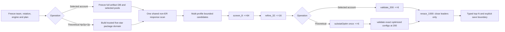

# GCSIM Artifact Optimizer Delivery Pipeline

Last updated: 2026-07-28.

This file is the concise delivery plan. The current technical contracts and
source map are in `GCSIM_OPTIMIZER_TECHNICAL_HANDOFF.md`. Historical milestone
logs were removed after the anytime replacement; use Git history when that
history is needed.

## 1. Goal

Deliver a rotation-specific optimizer that:

- finds a strong real-account build from user-selected set pools;
- compares theoretical 4p standards at equal investment;
- compares theoretical 2p+2p standards at equal investment;
- returns useful provisional progress quickly;
- publishes/saves only sufficiently validated results;
- does not claim an exhaustive optimum when the search is bounded.

Quality is more important than preserving the superseded broad algorithm.

## 2. Accepted product modes

### Required current modes

1. Account artifacts: selected set pools.
2. Theoretical: equal-investment 4p.
3. Theoretical: equal-investment 2p+2p.

For selected account search, one selected set per wearer is the normal default.
The same request shape also accepts several selected sets per wearer.

The account `2p+2p` checkbox adds canonical pair packages to account search.
Theoretical 2p+2p is a separate typed operation even when one UI action launches
it beside theoretical 4p.

### Deferred mode

Account artifacts across every represented database set is implemented by the
old all-set service but is deferred/experimental. It is not required to block
release of selected-set and theoretical modes.

### No speed modes

`Quick`, `Balanced`, and `Deep` are not product modes. The current fixed
internal phases are:

- `screen_8`;
- `refine_32`;
- `validate_200`;
- `rerace_1000`.

Separate user-selectable speed/quality modes may be designed only after real
benchmarks show useful tradeoffs.

## 3. Frozen decisions

- The account database is the artifact source of truth.
- Artiscan is only one possible upstream way data reached that database and is
  outside optimizer scope.
- Source-config artifact lines are replaced for simulation; they are not read
  as the account artifact pool.
- The optimizer is read-only until the user explicitly saves a result.
- Default artifact eligibility is five-star only.
- Account four-star artifacts require an explicit selected set/ID override.
- Theoretical anytime search is five-star only.
- Missing/invalid main stats and unsupported set mappings remove affected rows
  or packages fail-closed; they do not justify inventing data.
- No artifact ID may be assigned to two wearers in one account proposal.
- A real build means all five slots are present.
- ER is a hard minimum-stat constraint, not an automatically balanced damage
  stat.
- Generic per-wearer “stat at least X” constraints must be checked before
  simulation.
- Theoretical comparison uses the same investment contract and reports
  percent-to-best.
- Every published result means “best found under this frozen budget”.
- `content_fingerprint` deduplication of equal-content artifacts is an accepted
  limitation, not a blocker.
- Nothing is saved automatically.

## 4. Current pipeline

```mermaid
flowchart LR
    A["Freeze team, rotation, engine and plan"] --> B{"Operation"}
    B -->|Selected account| C["Freeze full artifact DB and selected pools"]
    B -->|Theoretical 4p/2p+2p| D["Build trusted five-star package domain"]
    C --> E["One shared non-ER response scan"]
    D --> E
    E --> F["Multi-profile bounded candidates"]
    F --> G["screen_8: <=64"]
    G --> H["refine_32: <=16"]
    H --> I{"Operation"}
    I -->|Selected account| J["validate_200: <=6"]
    I -->|Theoretical| K["substatOptim once: <=6"]
    K --> L["validate exact optimized configs at 200"]
    J --> M["rerace_1000: close leaders only"]
    L --> M
    M --> N["Typed top-N and explicit save boundary"]
```

## 5. Delivery packages

### Package A: typed contracts and frozen inputs — complete

Implemented:

- schema-v4 operation/request/result/progress contracts;
- separate 4p, 2p+2p, and account operation identities;
- selected/all account scopes;
- versioned work plans and cache/provenance namespaces;
- prepared config identity;
- trusted engine/catalog binding;
- immutable account database/run input;
- generic minimum-stat constraints;
- strict artifact assignment witnesses.

Current work-plan IDs:

- `anytime_approx_v1`;
- `theoretical_4p_anytime_approx`;
- `theoretical_2p2p_anytime_approx`.

### Package B: exact materialization and engine domains — complete

Implemented:

- arbitrary five-ID account build rendering;
- full four-wearer candidate config rendering;
- exact package/set rows;
- engine-derived 2p signature and canonical pair domains;
- reduced exhaustive account/theoretical oracles;
- exact candidate/config/evidence identities.

### Package C: selected-account anytime kernel — complete

Implemented:

- one dense database index;
- content-fingerprint grouping with physical replacement witnesses;
- multi-profile piece scoring;
- Pareto/frontier and shadow retention;
- bounded five-piece wearer candidates;
- integer bitmask no-reuse team combination;
- at most 64 diverse joint proposals;
- 8/32/200/1000 GCSIM race;
- only 200+ results in terminal top-N;
- cancellation, deadlines, progress, cache counters.

The old M4-M7 response/build/feedback loop remains reference code for parity
and the deferred all-set product. It is not the selected-set UI route.

### Package D: theoretical anytime kernel — complete

Implemented:

- inventory-independent 4p and 2p+2p requests;
- shared non-ER response;
- bounded package/layout/profile alternatives;
- at most 64 team proposals;
- 64@8 then 16@32 ordinary GCSIM race;
- at most six physical finalists;
- one `substatOptim` pass per finalist;
- exact 200-iteration validation;
- at most three close-leader 1000-iteration ordinary reraces;
- no second optimizer pass;
- percent-to-best;
- real 4p engine smoke through `BEST_FOUND`.

### Package E: UI adapter, progress, and explicit save — complete

Implemented:

- dedicated GCSIM Browser optimizer panel;
- selected-set and theoretical dispatch to anytime services;
- typed cancellation/progress delivery;
- current-best/progress display;
- CPU-aware execution plan;
- generic minimum-stat/ER input conversion;
- explicit save service for wearer presets and linked team result.

AppShell is outside this package and must not be changed for optimizer work.

### Package F: release evidence — in progress

Still required:

- real selected-account cold/warm end-to-end benchmark;
- real theoretical 2p+2p smoke;
- reduced exhaustive parity for new anytime kernels;
- adversarial winner-survival fixtures;
- explicit runtime and quality thresholds;
- cache/cancellation/deadline stress;
- decision on retirement of old broad services.

## 6. Account candidate requirements

The selected-account generator must retain more than crit value.

For each wearer/profile, pruning must distinguish:

- crit-rate-heavy and crit-damage-heavy pieces;
- ATK/HP/DEF scaling where the rotation proves it matters;
- EM/reaction branches;
- elemental goblets and alternative legal main stats;
- threshold/cap uncertainty;
- conflict shadows needed when another wearer consumes a strong artifact.

A piece is removable when it is dominated for the relevant profile/slot and
does not supply a retained diversity/shadow role. “Low crit” alone is not a
valid rejection rule.

The five-piece legality check applies minimum-stat floors before GCSIM. This is
where ER is balanced: combinations below the requested ER floor are discarded;
surplus ER is not rewarded by the damage response model.

## 7. Theoretical requirements

Theoretical search must:

- use the trusted engine's modeled set effects;
- keep concrete set identity even when equal 2p signatures are grouped for
  proposal optimization;
- preserve EM/main-stat and crit-rate/crit-damage alternatives;
- use equal investment for every compared state;
- run expensive `substatOptim` only after ordinary 8/32 screening;
- publish only exact optimized-config validation at 200 or 1000 iterations.

The 8/32 estimates are provisional search signals. They are not saveable
results and must not appear in terminal top-N.

## 8. Error, deadline, and fallback policy

- Unexpected response/materialization/wiring errors produce `FAILED`.
- They must never be hidden behind a conservative `BEST_FOUND`.
- Individual failed/timeout probes remain typed evidence.
- Already completed rows survive a local cancellation/deadline batch.
- A local 32-iteration theoretical deadline may continue with partial
  finalists if the global service budget remains.
- Explicit cancellation stops before further expensive work.
- If the global budget expires without 200+ evidence, the result is
  `DEADLINE`, not a provisional winner.

## 9. Progress contract

Progress must be emitted at:

- preflight;
- account database/layout indexing;
- response scan;
- candidate generation;
- account joint no-reuse search;
- 8-iteration screening;
- 32-iteration refinement;
- 200-iteration validation;
- optional 1000-iteration rerace;
- completion.

Every completed simulation updates completed/planned counts. Cache-hit counts
are stage-local, cumulative, and include non-leaders. Observer exceptions do
not alter execution.

The UI may show the current 8/32 leader with a clear provisional label. Save
actions remain unavailable until a 200+ result exists.

## 10. Persistence contract

Search does not mutate:

- artifact ownership;
- current equipment;
- saved character presets;
- GCSIM source config;
- import snapshots.

After a successful result the user may explicitly:

1. save any unsaved wearer result as a character artifact preset;
2. accept or edit the default
   `best_found_<other team members>` name;
3. reuse already saved presets without duplicates;
4. save the four preset references as one linked GCSIM team result.

If the user does not save, the result is disposable.

Execution evidence follows the same disposable boundary. Successful ordinary
screening runs remove their default-owned `farming-runs` directory after the
typed DPS summary is extracted. Two-stage optimizer runs retain the small
input/optimized/result evidence used by finalist validation, but remove their
per-run private engine copy after process completion. Failed runs remain
diagnostic and the generic `python -m run_workspace.gcsim.cleanup` command
bounds normal, screening, and two-stage run roots independently to 50 newest
directories / 256 MiB by default. The content-addressed optimizer cache is
reusable evidence rather than a temporary run directory.

Later UI work:

- dedicated GCSIM preset-combination tab;
- one atomic “apply all four” action;
- clear indication of many near-equivalent physical replacements.

## 11. Verification policy

Every code package must include:

- typed contract round trips and fail-closed validation;
- deterministic identity/cache tests;
- cancellation and deadline tests;
- per-completion progress tests;
- CPU-budget assertions;
- reduced oracle winner-survival tests where applicable;
- real-engine smoke for production rendering/execution boundaries.

Current real 4p theoretical smoke (2026-07-28):

- 125 response probes;
- 64 candidates at 8 iterations;
- 16 candidates at 32 iterations;
- 6 physical finalists;
- smoke-capped 2 finalists at 200 iterations;
- `BEST_FOUND` in 106.36 seconds.

Current real selected-set account smoke on the local 520-artifact database
(2026-07-28):

- Chasca/Ororon/Furina/Bennett, each restricted to its selected standard set;
- 125 response probes, then 64@8, adaptive 8@32, 6@200, and 2@1000;
- six saveable exact builds after 117.64 seconds;
- `BEST_FOUND` in 177.27 service seconds / 180.97 diagnostic seconds;
- 13199.8883 DPS versus the source config's 13153.6 on the same rotation
  (`+0.3519%`);
- exactly 20 distinct artifact IDs in the winner;
- cold cache evidence: 0 hits, 205 misses.

Current real theoretical 2p+2p smoke (2026-07-28):

- 39 modeled five-star 2p sets, 741 concrete pairs, 526 representative groups;
- 125/125 response probes, 64@8, 16@32, and 6 physical finalists;
- smoke-capped 2 finalists at 200 iterations;
- `BEST_FOUND` in 124.00 seconds with no account/database input.

Current cold/warm cache evidence:

- theoretical 4p: the validation session now resolves its own default cache
  store when caching is enabled. Before that fix, repeat runs still missed two
  expensive finalists (205/207 hits), took about 26-27 seconds, and could return
  a different winner. After population, repeat runs are 207/207 hits in 6.234
  and 6.063 seconds with the identical winner;
- theoretical 2p+2p: 104.625 seconds at 0/207, then 11.594 seconds at
  207/207, with an identical cached result;
- selected account: 236.859 seconds at 0/214, then 20.000 seconds at 214/214,
  with the same 20-ID, 14360.0657-DPS winner;
- simulation evidence is cached; selected dense-pool and joint-search work is
  deliberately recomputed.

Reduced quality evidence now exercises the production kernels directly:

- account anytime matches the exhaustive contested-artifact physical top-1;
- theoretical bounded proposals retain exhaustive winners for low/high crit,
  triple-EM, EM+crit, HP/heal, and DEF coordinated cases;
- stat-floor, unusual-main, content-deduplication, and conflict-shadow cases
  remain covered by focused tests.
- deterministic randomized exhaustive corpora contain 100 account and 100
  theoretical cases; both pass the accepted provisional thresholds of at least
  95% exact top-1, at most 0.5% mean regret, and at most 2% maximum regret.

The full GCSIM backend suite passes 621/621 tests (233.513 seconds), and the
optimizer-panel UI suite passes 5/5 tests (0.205 seconds). The suite count
changed because obsolete broad-orchestrator tests were deleted and current
release-policy/randomized-corpus coverage replaced them.

No-cache process-tree memory evidence at 8 CPU, sampled every 20 ms:

- selected account: `BEST_FOUND` in 131.266 seconds, 335,290,368-byte
  aggregate working set, 554,262,528 aggregate private bytes, at most 9 live
  processes;
- theoretical 2p+2p with the two-finalist smoke cap: `BEST_FOUND` in 93.125
  seconds, 351,248,384-byte aggregate working set, 564,678,656 aggregate
  private bytes, at most 9 live processes.

These are sums over the live Python/GCSIM process tree, not the obsolete
coordinator-only sample.

Real-engine all-database v2 evidence uses the same prepared team, local
520-artifact database, 8 CPUs, 4p packages, and an isolated temporary cache:

- 31 modeled sets and 124 wearer/package decisions;
- cold `BEST_FOUND`: 233.531 service / 233.578 wall seconds, 0/208 hits;
- warm `BEST_FOUND`: 89.406 service / 89.453 wall seconds, 208/208 hits;
- identical 7795.1378-DPS, 1000-iteration, 20-distinct-ID winner in both runs.

The warm result confirms that wide-pool construction and joint no-reuse search
remain expensive even when every simulation is cached. Keep this optional mode
experimental; do not apply its timing to selected-set release gates.

Do not use superseded broad-path measurements as the current algorithm's
performance.

## 12. Release checkpoint and next sequence

The user accepted these provisional release limits on 2026-07-28:

- selected cold first saveable <=150 seconds, cold terminal <=300 seconds, and
  warm terminal <=30 seconds;
- theoretical 4p and 2p+2p cold terminal <=180 seconds and warm terminal <=20
  seconds;
- strict exact top-1 for mandatory adversarial/exhaustive fixtures;
- randomized exhaustive exact top-1 >=95%, mean regret <=0.5%, and maximum
  regret <=2%.

The typed fail-closed policy and recorded runtime matrix pass. The two 100-case
randomized corpora pass, the mandatory cases remain strict, the theoretical 4p
cache defect is fixed, and the obsolete broad selected/theoretical
orchestrators have been removed.

All-database account search now uses the current bounded anytime kernel under
`all_database_sets_anytime_approx_v1` version 2. It makes only a best-found
claim. Its real-engine benchmark is recorded, but the 89.453-second warm wall
time keeps it experimental. This optional mode does not block selected-set or
theoretical use.

After UI use is possible, compare results and waiting time with the user's
hand-built teams and deliberately recalibrate the provisional policy. Until
then, do not change its limits silently.

## 13. Confirmed future ideas

- Automatically discover public GCSIM rotations whose team members match the
  selected team.
- Add the linked four-preset GCSIM tab/apply flow described above.
- Surface replacement-rich results without flooding the user with a full
  search journal.

These ideas must not pull Artiscan import logic into optimizer search.
