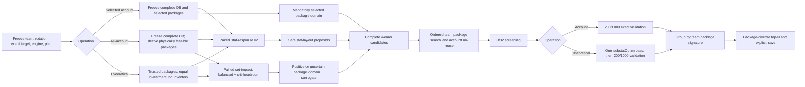

# GCSIM Artifact Optimizer Delivery Pipeline

Last updated: 2026-07-29.

This file is the concise delivery sequence. Detailed contracts and source
ownership live in `GCSIM_OPTIMIZER_TECHNICAL_HANDOFF.md`. Historical milestone
logs belong in Git history.

## 1. Goal and accepted operations

Deliver one rotation- and target-specific backend that supports:

1. account artifacts under user-selected set pools;
2. account artifacts across all physically feasible database sets;
3. theoretical equal-investment 4p standards;
4. theoretical equal-investment 2p+2p standards.

The search is bounded and reports the best result found under a frozen,
versioned plan. It never claims an exhaustive global optimum.

One selected set per wearer is the normal selected-account default. The same
typed request accepts several selected packages. The source config's active set
is only a UI default; every chosen package is mandatory search input.

All-account uses only packages physically formable from the complete account
database. Theoretical uses the trusted engine package domain and never reads
account inventory.

`Quick`, `Balanced`, and `Deep` are not product modes. The internal
`screen_8`, `refine_32`, `validate_200`, and `rerace_1000` phases remain fixed
until real measurements justify user-selectable speed/quality policies.

## 2. Frozen decisions

- Account candidate truth is the complete read-only artifact DB captured at run
  start.
- Artifact row source/provenance does not filter optimizer candidates.
- Source-config set/stat rows are replaced for candidate simulation.
- The exact selected chamber/scenario, or explicit DPS Dummy, is shared by stat
  response, set impact, source control, candidate race, and final validation.
- Hidden target fallback is forbidden.
- Search is read-only and nothing is saved automatically.
- Default eligibility is valid five-star artifacts.
- Account four-star artifacts require an explicit set/ID override.
- Theoretical search is five-star only.
- Missing/invalid mains and unsupported mappings fail closed only for affected
  rows/packages where safe.
- A physical account success has five slots per wearer and twenty globally
  distinct artifact IDs.
- Generic `stat >= X` floors are checked before GCSIM.
- ER sufficiency is only an explicit floor; it is never automatically balanced.
- Direct ER-to-damage scaling modeled by GCSIM remains ordinary damage scaling.
- Infinite/boosted energy is a separate explicit simulation choice.
- Theoretical comparisons use equal legal investment and report
  percent-to-best.
- Account source build evidence is informational control evidence only. It
  cannot stop search, prioritize its sets, or prune packages.
- `content_fingerprint` equal-content deduplication is accepted.
- Terminal top-N contains one best candidate per ordered team package signature.

## 3. Current pipeline

```mermaid
flowchart LR
    A["Freeze team, rotation, exact target, engine, plan"] --> B{"Operation"}
    B -->|Selected account| C["Freeze complete DB and selected packages"]
    B -->|All-account| D["Freeze complete DB; derive physically feasible packages"]
    B -->|Theoretical| E["Trusted packages; equal investment; no inventory"]
    C --> F["Paired stat-response v2"]
    D --> F
    E --> F
    D --> G["Paired set-impact: balanced + crit-headroom"]
    E --> G
    F --> H["Safe stat/layout proposals"]
    G --> I["Positive or uncertain package domain + surrogate"]
    C --> J["Mandatory selected package domain"]
    H --> K["Complete wearer candidates"]
    I --> K
    J --> K
    K --> L["Ordered team package search and account no-reuse"]
    L --> M["8/32 screening"]
    M --> N{"Operation"}
    N -->|Account| O["200/1000 exact validation"]
    N -->|Theoretical| P["One substatOptim pass, then 200/1000 validation"]
    O --> Q["Group by team package signature"]
    P --> Q
    Q --> R["Package-diverse top-N and explicit save"]
```

## 4. Implemented foundations

### Contracts and frozen inputs

Implemented:

- schema-v4 typed product requests, result schema v3, and progress schema v3;
- separate selected/all-account, theoretical 4p, and theoretical 2p+2p
  identities;
- explicit target/scenario binding;
- immutable complete DB input and hash;
- exact five-artifact and full-team witnesses;
- generic stat floors;
- engine/catalog/work-plan/cache provenance;
- typed cancellation, deadline, progress, and uncertainty.

Primary work-plan IDs are `anytime_approx_v2`,
`all_database_sets_anytime_approx_v3`,
`theoretical_4p_anytime_approx_v2`, and
`theoretical_2p2p_anytime_approx_v2`. Exact plan versions are owned by their
module constants.

### Paired stat-response v2

Implemented against engine capability `gtt_stat_response_v2`:

- common deterministic seed panel;
- expected-damage collection;
- team and ordered per-character DPS;
- paired deltas and uncertainty;
- sparse and realistic balanced anchors;
- legal whole-main interventions;
- `dominant`, `secondary`, `negligible`, and `uncertain` classification;
- indirect support-effect visibility;
- conservative retention for failed/noisy evidence.

### Paired set-impact

Implemented against engine capability `gtt_set_response_v1`:

- remove all set rows from a fixed synthetic baseline;
- add exactly one package to one wearer;
- measure personal, team, and all four character deltas on the exact selected
  target with common seeds;
- run both `balanced` and `crit_headroom` panels;
- classify personal/team/both positive, uncertain-retained, or negligible;
- prune only proved-negligible packages;
- emit a confidence-adjusted package surrogate for proposal ordering.

The patch marker is diagnostic. Capability presence is authoritative because a
newer cumulative patch marker may still contain wave, stat-response, and
set-response operations.

### Physical account search

Implemented:

- dense artifact indexes and bit masks;
- content-fingerprint grouping with bounded physical replacements;
- Pareto/threshold/crit/reaction/conflict retention;
- complete five-slot candidates;
- global no-reuse;
- all-account 4p feasibility by four distinct usable slots, not raw row count;
- retained-package coverage and package-surrogate ordering;
- neutral-set response used only as soft ranking at no fewer than 32
  iterations;
- a mandatory source-package recall/control anchor when resolvable;
- bounded physical regeneration inside up to eight package signatures, with up
  to twelve joint proposals per signature;
- package-signature diversity during race/final assembly;
- exact 8/32/200/1000 multifidelity evaluation.

Selected packages remain mandatory and are not removed by the broad all-set
screen.

### Top-N

The terminal result groups validated rows by the ordered four-wearer package
signature. A wearer signature contains package kind plus its canonical 4p set
or sorted 2p+2p pair. Only the best exact candidate for one full team signature
occupies a rank.

Different physical artifacts under the identical package combination are
replacement evidence. They do not fill top 1/2/3 with near-duplicates.

## 5. Mode-specific requirements

### Selected-account

1. Read every eligible DB artifact that can form a chosen package.
2. Evaluate each chosen package in its real set-conditioned context.
3. Preserve useful crit, EM, scaling, elemental-main, threshold, and uncertain
   branches.
4. Apply stat floors before simulation.
5. solve four-wearer no-reuse and run exact candidates.
6. Return the best validated row for each team package signature.

### All-account

1. Derive only trusted packages physically formable from the complete DB.
2. For 4p, require four distinct usable set slots plus a legal fifth slot.
3. Probe every feasible `(wearer, package)` with both set-impact panels.
4. Retain personal gain, team gain, and uncertainty.
5. Guarantee at least one strongest legal physical representative per retained
   package before artifact variants consume the budget.
   Byte-identical exact team configs merge their package-coverage labels and run
   once; no retained obligation is silently dropped.
6. Treat neutral stat-response as ranking evidence only; do not hard-delete
   HP/EM/crit/elemental main-stat branches from it.
7. Rebuild and screen the source config's package signature as a recall/control
   anchor when physically resolvable. It receives no score bonus and is not an
   early-stop threshold.
8. For `any HP%` / `any EM` supports, use one best representative per package
   during broad package search and expand only for finalists/package changes or
   no-reuse repair.
9. Search feasible ordered team package combinations.
10. Regenerate mixed legal-main physical candidates inside up to eight
    shortlisted team package signatures and screen every generated proposal.

The untouched source build may also be simulated as same-target informational
control. Neither that score nor the source-package anchor can stop search.

### Theoretical 4p and 2p+2p

Required contract:

- ignore account inventory and source sets;
- give every compared package the same legal investment;
- keep exact engine-modeled set effects active;
- give every 4p package set-impact coverage before truncation;
- for 2p+2p, probe single-2p components/effect classes before constructing
  bounded pair packages;
- preserve concrete identities and uncertain packages;
- retain every paired-impact result, but when the domain exceeds quick-tier
  capacity shortlist at most 30 package anchors per wearer and report the
  retained-but-unscreened remainder explicitly;
- require a balanced complete-main anchor for every quick package, then assign
  additional complete layouts package-round-robin;
- preserve generic scaling, EM/reaction, elemental-damage, and crit layout
  archetypes inferred from response, without character hardcodes;
- use impact/response evidence to build joint package/layout proposals;
- run `substatOptim` only once per finalist and validate exact output.

The corrective package proposal search is implemented. Focused regressions prove
late/high-impact packages survive bounded selection, single-2p components feed
prospective pairs, non-representative concrete pair aliases survive terminal
packaging, and terminal Top-N is package-signature distinct. Real DPS-Dummy 4p
and 2p+2p runs reached validated `BEST_FOUND`; further user-team calibration is
still required.

## 6. ER and stat floors

Account requests accept generic per-wearer lower bounds over the complete
five-artifact contribution. They run before GCSIM, so illegal combinations
consume no simulation time.

ER follows the same rule:

- the user explicitly supplies the required floor;
- below-floor builds are rejected;
- above-floor builds receive no generic energy reward;
- direct ER-to-damage conversion remains visible in exact GCSIM damage.

Theoretical operations do not inherit account floors and do not auto-optimize
energy sufficiency.

## 7. Errors, progress, and validation

Unexpected response, set-impact, materialization, or wiring errors produce
`FAILED`; they are not converted into a conservative winner. Failed/noisy
individual evidence is retained as uncertainty only when its typed contract is
otherwise valid.

Progress stages are:

- preflight;
- layout/index scan;
- stat-response scan;
- set-impact scan;
- candidate generation;
- joint package/no-reuse search;
- screening;
- refinement;
- final validation;
- rerace;
- completion.

Only 200+ exact evidence enters terminal top-N or save. Lower-fidelity leaders
are provisional. Progress schema v3 carries the active `n`, clears a stale
leader when fidelity changes, distinguishes provisional/verified/final scope,
and labels uncertainty as standard error (`SE`).

Ordinary wave-scenario preflight checks capability
`gtt_wave_scenario_payload`; it does not reject a newer cumulative patch marker.

## 8. Persistence

Search does not mutate equipment, presets, the source config, or History.

After a saveable result, the user may explicitly:

1. save any unsaved wearer result as a normal artifact preset;
2. accept or edit `best_found_<other team members>`;
3. reuse already saved exact presets without duplicates;
4. save the four preset references as one linked GCSIM team result.

No save means the result is disposable. Atomic apply-all and a dedicated linked
presets tab remain later UI work.

Theoretical terminal rows expose their equal-investment evidence directly:
each wearer has a typed 4p/2p+2p package, sands/goblet/circlet mains, and the
exact fixed plus liquid substat-roll allocation used for final validation.

Generated run directories are diagnostic, not product persistence. Successful
ordinary screens clean their default-owned run directory, two-stage runs remove
their private engine copy, and `python -m run_workspace.gcsim.cleanup` bounds
normal, screening, and optimizer roots. The content-addressed optimizer cache is
reusable evidence, with automatic retention at 20,000 entries / 256 MiB and
stale atomic-temp cleanup; it is also covered by the cleanup CLI dry-run/apply
report.

## 9. Next release gate

Completed on 2026-07-29:

1. theoretical 4p/2p+2p impact-driven package proposal search;
2. focused package-survival, concrete-pair packaging, and package-signature
   Top-N regressions;
3. real DPS-Dummy all-account, theoretical 4p, and theoretical 2p+2p smokes;
4. all-account soft-response/source-anchor/local-refinement correction;
5. theoretical balanced-anchor, fair mixed-layout, and wide-domain correction;
6. progress schema v3 and readable theoretical allocation result/UI.

Next, in order:

1. rerun the reported Chasca/Ororon/Furina/Bennett comparisons under the new
   plan identities, then compare all operations with more user-built teams on
   both DPS Dummy and the exact selected chamber;
2. calibrate materiality/pruning budgets;
3. remeasure cold/warm runtime, cache, cancellation, memory, and wide-pool
   behavior;
4. validate explicit save/preset UI behavior.

Selected-account, theoretical 4p, and theoretical 2p+2p are the mandatory
usable outcomes. All-account is accepted but remains optional/experimental
until quality and wide-pool runtime are satisfactory.

Confirmed later ideas:

- automatically discover published GCSIM rotations for the same four-character
  roster;
- link four saved character presets in one GCSIM presets view;
- apply all four explicitly and atomically;
- show a compact indication of near-equivalent replacements.
