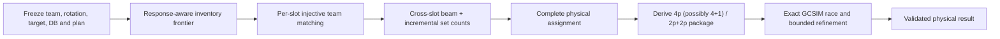

# GCSIM Artifact Optimizer Delivery Pipeline

Last updated: 2026-08-02.

This file is the short delivery and review map. The authoritative algorithm,
contracts, invariants, source ownership, and exact work-plan behavior live in
`GCSIM_OPTIMIZER_TECHNICAL_HANDOFF.md`. Do not duplicate them here.

For an optimizer-only audit, these two handoffs are the required context. Do
not preload the unrelated sections of the project-wide `TODO.md` or `CODEX.md`;
consult their optimizer section or broader project rules only when needed.

## 1. Accepted product operations

The optimizer has four separate typed operations:

1. account artifacts from user-selected set pools;
2. account artifacts across all physically feasible database sets;
3. theoretical equal-investment 4p packages;
4. theoretical equal-investment 2p+2p packages.

The search is bounded. A result means only:

> best build found under the frozen, versioned work plan

It is not proof of the exhaustive global optimum. `Quick`, `Balanced`, and
`Deep` are not accepted product modes; current iteration tiers are internal
search/validation phases.

## 2. Non-negotiable boundaries

- Account operations read the complete artifact database captured at run start.
  Import source, equipment, owner, lock, location, and preset state are not
  optimizer filters.
- Selected-account searches every user-selected package. All-account derives
  only packages that can be formed from the captured database. Theoretical
  operations never read account artifacts.
- The existing package-first all-account implementation runs selected-account
  first and injects its exact confirmed winner. It is retained only as a frozen
  fallback/diagnostic while the artifact-first shared kernel is built; it is not
  release-ready and must not be extended into the target architecture.
- Every response probe, package probe, candidate, control, and final validation
  uses the same explicit selected chamber/scenario or explicit DPS Dummy.
- Account candidates use stored artifact values and globally unique physical
  artifact IDs. Theoretical candidates use one equal legal investment budget.
- ER sufficiency is not inferred or balanced. The user may request the same
  generic pre-simulation `stat >= X` floor used for any supported stat.
- Search is read-only. It does not equip artifacts, edit presets, mutate the
  source config, or write History. Saving is a separate explicit action.
- Equal-content `content_fingerprint` deduplication is an accepted limitation.

## 3. Target account pipeline

```mermaid
flowchart LR
    A["Freeze team, rotation, target, DB and plan"] --> B["Response-aware inventory frontier"]
    B --> C["Per-slot injective team matching"]
    C --> D["Cross-slot beam + incremental set counts"]
    D --> E["Complete physical assignment"]
    E --> F["Derive 4p (possibly 4+1) / 2p+2p package"]
    F --> G["Exact GCSIM race and bounded refinement"]
    G --> H["Validated physical result"]
```

Selected and all-account are constraints on this same physical kernel. Selected
limits the allowed set/package domain; all exposes every modeled physically
feasible domain. Neither gets a separate candidate generator. Package identity
is derived after the physical assignment rather than used to partition the
inventory before matching.

Theoretical equal-investment operations remain separate because they have no
physical inventory. The technical handoff defines safe pruning, exact matching,
fidelity, uncertainty, progress, and error semantics.

## 4. Current stage

The desktop still executes the current selected/package-first implementation;
artifact-first primitives exist only for offline validation and are not yet a
parallel shadow execution path or wired to either account route. Package-first
all-account remains available only as a comparison
fallback and is not a release candidate. Do not add more package-first search
lanes, signature repair, or post-race expansion.

The accepted selected baseline is selected plan 11 with a pre-deadline-fix race
plan 5. On the frozen UI-entrypoint request it returned
`139577.8505 ± 292.4415`, `n=1000`, in `628.297 s`. Evidence:

- immutable UI audit:
  `debug/gcsim_optimizer_ui_runs/20260802T091044477190Z-16092-0c9db722f11c.json`;
- mirrored audit:
  `debug/gcsim_optimizer_benchmarks/ui-production-v11-selected/canonical-ui-selected-audit.json`;
- typed result:
  `debug/gcsim_optimizer_benchmarks/ui-production-v11-selected/canonical-ui-selected-result.json`.

The effective simulation policy recorded by all three files is
`ignore_burst_energy=true`; `boosted_energy_enabled=false` does not make this a
normal-energy benchmark. The current common account race is plan 6. It handles a
terminal deadline/cancellation batch before enforcing required-proposal success,
so a required row skipped by that terminal condition cannot erase an already
successful saveable validation. The plan-5 result remains an offline comparator,
not plan-6 cache/result evidence.

The first raw componentwise measurement on the current 520-piece database put
519 pieces in the set-aware first layer and 512 in an off-piece-equivalent first
layer. These are advisory counts, not a safe removal proof: exact GCSIM can be
non-monotone in a raw axis (for example ER can change an `energy < max`
condition). Inventory-frontier plan 2 therefore retains every eligible physical
row and shadows only ineligible rows. CV/RV, raw skyline depth, or another scalar
may provide soft ordering, but cannot be a hard artifact prune.

Every completed account UI run must continue to write a compact immutable audit
plus `debug/gcsim_optimizer_ui_runs/latest.json`, including frozen identities,
loaded module fingerprints, plan identities, compiled configs, and exact
physical IDs. That audit is the cutover proof; backend-only output is not button
parity.

## 5. Next work, in order

1. Extend the implemented no-prune physical inventory catalog with response-aware
   ordering. Preserve response dimensions, slot/main/set identity, stat floors,
   and no-reuse alternatives; allow hard pruning only behind a scenario-specific
   monotonicity or admissible-bound proof.
2. For each artifact slot, build injective four-wearer matchings so one physical
   ID cannot be assigned twice and a locally weaker piece can survive when it
   unlocks the better team assignment.
3. Combine slot matchings in a cross-slot beam while carrying physical-ID masks,
   per-wearer set counts, main/stat totals, constraints, and admissible upper
   bounds. Do not decide packages before this stage completes an assignment.
4. Derive each wearer's 4p package (including its possible single off-piece) or
   2p+2p package from the completed physical assignment, materialize the exact
   config, and run common plan-6 GCSIM plus bounded refinement.
5. Run the kernel in shadow beside selected plan 11 on byte-identical frozen
   inputs. Gate on witness survival, exact legality/no-reuse/materialization,
   deadline/cancellation preservation, result quality, deterministic identities,
   and bounded runtime across a wider team/rotation/target corpus.
6. Make selected/all domain policies feed the same kernel and prove selected
   witnesses remain reachable in the all domain under the same downstream
   fidelity policy.
7. Cut both account routes over only after the audit proves the shared kernel was
   loaded. Then remove the package-first account paths and their compatibility
   tests; do not delete them before the gates pass.
8. Validate explicit preset/team-result saving separately from search quality.

Do not add speed modes while the base evaluation algorithm is under audit.

## 6. Change boundary

Optimizer-owned code and narrow scheduler/materializer wrappers may be changed.
Any required change to importer, shared artifact identity/deduplication,
equipment, Artifact Browser presets, History, or global AppShell behavior must
be discussed with the user first.
