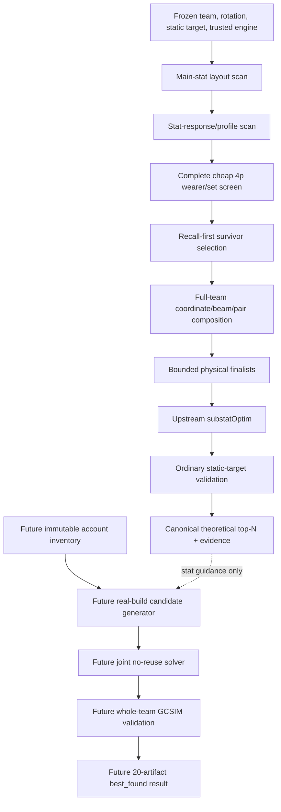

# GCSIM Optimizer Technical Handoff

Reviewed: 2026-07-23

Code baseline: `7a390c1` (`Implement bounded GCSIM artifact optimizer backend`)

Status: the inventory-independent theoretical `4p` backend is executable end to
end and heavily contract-tested, but its ranking is still an experimental
heuristic. Milestone 0 product contracts now define the three separate
operations, target-package identities, account depths, common terminal/progress/
top-N semantics, and a lossless adapter for the current theoretical `4p`
result. The real-account artifact optimizer, theoretical `2p+2p`, concrete
product budget presets, account result/preset adapters, and UI do not exist yet.

This is the technical source of truth for optimizer mechanics, invariants,
performance work, and extension seams. Use
`GCSIM_ACCOUNT_ARTIFACT_OPTIMIZER_PIPELINE.md` for implementation ordering.
Use `GCSIM_ENGINE_INTEGRATION_PLAN.md` for the wider engine lifecycle, Browser,
patch, and release boundary. `GCSIM.md` remains the upstream research record.

## 1. Product modes must stay separate

The product is not one search that silently combines theoretical farming advice
with every artifact on the account. It has distinct commands and result claims:

| Command | Search domain | Current status | Honest result claim |
| --- | --- | --- | --- |
| Theoretical `4p` set combinations | Abstract equal-investment main/substats and complete `4p` packages | Executable, experimental | Best found in the evaluated theoretical `4p` domain |
| Theoretical `2p+2p` set combinations | Abstract equal-investment main/substats and complete `2p+2p` packages made from two different set keys | Not implemented | Best found in the evaluated theoretical `2p+2p` domain |
| Account artifacts for selected sets | Real account artifacts under four explicit `4p` or distinct-set `2p+2p` target packages | Not implemented | Best found on the frozen account snapshot under those targets |

The UI must expose separate set-search actions for `4p` and `2p+2p`. The
real-account action must expose explicit `Quick`, `Balanced`, and `Deep` budget
presets. Those presets change budgets, not legality or the meaning of the
objective. Every preset remains cancellable and returns typed `best_found`
evidence when it has a valid completed candidate.

A selected theoretical row may populate the four account targets through `Use
as target sets`, but this is only data transfer. The user may edit any target
before running the account search.

Automatic `2p+1+1+1`, one active `2p` with three unmatched pieces, and
rainbow/no-active-bonus search are deliberately outside the product domain.

## 2. Current architecture in one view



The lower account branch must be a separate layer. A real artifact must never be
encoded as another `StatProfile` or `FourPieceSetState`.

## 3. Public entry points and source map

### Product contract boundary

- `run_workspace/gcsim/optimizer_product_contracts.py`
  - schema-v1 `GcsimOptimizerOperation` values for theoretical `4p`,
    theoretical `2p+2p`, and selected-target account artifacts;
  - `GcsimFourPieceTargetPackage` and canonical unordered
    `GcsimTwoPlusTwoTargetPackage`, including versioned set-parameter identity;
  - versioned frozen source simulation, search-budget, request, progress,
    terminal-result, top-N, and uncertainty contracts;
  - distinct cache/provenance namespaces for every operation;
  - `build_gcsim_optimized_four_piece_operation_request(...)` and
    `adapt_gcsim_optimized_four_piece_result(...)`, which expose the current
    theoretical `4p` result through the common contract while retaining the
    original typed evidence graph.

Account `Quick`, `Balanced`, and `Deep` are typed depth identities only at this
stage. Their concrete measured parameter registry remains Milestone 9. A
theoretical operation cannot carry account depth or selected account targets;
an account request requires depth, one target per four source wearers, and an
inventory snapshot hash. These constructors fail before any process boundary.

Common top-N order is observed DPS mean descending with candidate SHA as the
deterministic tie-break. Rank one is the `reference`. For later ranks, missing
SE on either candidate is `unknown`, never zero; otherwise schema v1 uses
`abs(delta) <= 2 * hypot(best_se, candidate_se)` for `within_noise`, with the
rest labeled `separated`. Cancelled, deadline, and failed terminals may retain
validated best-so-far rows; not-ready and no-success may not claim them.

### Top-level theoretical flow

- `run_workspace/gcsim/farming_optimized_advisor.py`
  - `run_gcsim_optimized_four_piece_advisor(...)`
  - `GcsimOptimizedAdvisorSession`
  - `GcsimOptimizedAdvisorRequest`
  - `GcsimOptimizedAdvisorResult`
- `run_workspace/gcsim/farming_auto_advisor.py`
  - `run_gcsim_automatic_four_piece_advisor(...)`
  - layout discovery followed by response and set/team screening, without the
    deep finalist race.
- `run_workspace/gcsim/farming_advisor.py`
  - response and set/team screening when layouts are already supplied.
- `run_workspace/gcsim/farming_controller.py`
  - direct cheap complete-coverage `4p` screen plus team composition.
- `run_workspace/gcsim/farming_finalist_optimizer.py`
  - deep upstream optimization of an already bounded physical-finalist list.
- `run_workspace/gcsim/optimizer_runner.py`
  - one low-level, isolated, two-stage upstream optimizer execution.

The optimizer symbols intended for application reuse are exported from
`run_workspace/gcsim/__init__.py`.

There is no production request builder that turns `Quick`, `Balanced`, or
`Deep` into the nested budget graph. Callers currently have to build all
requests, baseline physical states, layouts, profiles, and budgets themselves.

### Supporting modules

| Concern | Module |
| --- | --- |
| Product operation/target/progress/result contracts | `optimizer_product_contracts.py` |
| Trusted manifest/source/executable/catalog binding | `optimizer_engine_context.py` |
| Parser-safe static-target validation | `config_structure.py` |
| Legal theoretical main-stat rows/layouts | `optimizer_config.py` |
| Exact complete `4p` overrides | `optimizer_set_config.py` |
| One bound theoretical candidate | `optimizer_candidate.py`, `optimizer_backend.py` |
| Source-backed set capabilities | `artifact_set_catalog.py` |
| Equal-investment response allocations | `farming_profile_config.py` |
| Profile and survivor domain types | `farming_search.py` |
| Main-stat discovery | `farming_layout_scan.py` |
| Stat-response discovery | `farming_response.py`, `farming_response_scan.py` |
| Proof-carrying candidate materialization | `farming_pipeline.py` |
| Ordinary GCSIM process and CPU scheduler | `farming_evaluator.py` |
| Full-team heuristic composer | `farming_team_search.py` |
| Persistent ordinary-sim cache primitives | `optimizer_cache.py` |
| Real account config/stat/set rendering already available | `selected_team_config.py`, `config_blocks.py`, `prepared_config_adapter.py` |

## 4. Frozen engine and simulation contract

Every production optimizer operation must begin with
`load_active_gcsim_optimizer_engine_context(...)`.
`GcsimOptimizerEngineContext` binds:

- active engine id and version;
- source tree hash;
- actual executable hash;
- manifest-declared hashes;
- source-backed artifact-set catalog fingerprint;
- pinned optimizer renderer contract;
- one combined `binding_sha256`.

The current renderer contract is exactly `gcsim-v2.42.2`. A source edit,
engine patch, rebuild, binary replacement, or catalog change invalidates the
binding. Rebuild/reseal the active engine; never bypass the failed trust check.

All optimizer comparisons use
`validate_gcsim_farming_static_config(...)` and therefore require:

- exactly one target statement;
- exactly one explicit `hp=999999999`;
- no target `type=` that could replace the pinned HP;
- no GTT wave directive;
- exactly one `options` statement;
- one canonical semicolon-terminated physical row for every optimizer-sensitive
  character, weapon, set, stats, target, and options statement;
- LF or CRLF only, with comments and strings interpreted compatibly with the
  pinned GCSIM lexer.

This static dummy is intentional. Optimizer results are rotation- and
static-target-specific and are not Abyss wave rankings. Do not spend another Go
patch merely to run `substatOptimFull` with the wave scenario. A new engine
patch needs a separately measured compatibility or performance blocker.

## 5. Current theoretical algorithm

### 5.1 Main-stat discovery

`GcsimMainLayoutScanSession` reduces the legal `5 x 12 x 7 = 420`
sands/goblet/circlet combinations per wearer:

1. Start from the generic `ATK% / ATK% / CR` seed.
2. Vary one slot while keeping the other two fixed.
3. Evaluate 22 unique coordinate layouts per wearer.
4. Retain up to `max_values_per_slot` values for each variable slot.
5. Evaluate their bounded Cartesian product.
6. Retain up to `max_layouts_per_wearer`.

`GcsimMainLayoutScanBudget` defaults to two values per slot, three retained
layouts per wearer, and a ten-second per-candidate timeout.

Important limitation: layout discovery runs on caller-supplied baseline sets
and the baseline response profile. A different set can change the best main
stats. This is why current output is not release-reliable until set-aware
refinement and an oracle gate exist.

### 5.2 Stat-response discovery

`build_default_gcsim_screening_profile_bank(...)` creates a character-agnostic
bank from the pinned stat schema:

- one balanced baseline;
- one focus direction for each of `atk%`, `cr`, `cd`, `em`, `er`, `hp%`,
  `def%`, flat `atk`, flat `def`, and flat `hp`;
- optional axis-pair profiles, disabled by default.

For each wearer, response probes change that wearer's abstract allocation while
the rest of the full team remains frozen. `select_wearer_response_profiles(...)`
keeps:

- the mandatory baseline;
- strongest successful directions;
- statistically unresolved directions;
- unknown-uncertainty branches;
- required profile coverage.

If mandatory profiles cannot fit the configured cap, the selector fails closed
instead of silently removing them.

This discovery is also baseline-set-sensitive. It is not a permanent stat-weight
table for a character.

### 5.3 Equal-investment envelope

Cheap screening mirrors the pinned upstream allocation envelope rather than
inventing free stats:

- two fixed rolls of every supported substat;
- twenty liquid rolls;
- at most ten liquid rolls in one stat;
- one-max-roll values from `GCSIM_SUBSTAT_ROLL_VALUES`;
- main-stat-aware substat capacity;
- two fewer liquid rolls and a `0.04` rarity modifier per forced 4-star set
  piece.

The contract id is `gcsim-v2.42.2-kqm-envelope-v1`.

Changing `total_liquid_substats`, `indiv_liquid_cap`, or
`fixed_substats_count` changes the investment comparison itself. These are not
ordinary speed controls and must be included in provenance and product wording.

### 5.4 Complete cheap `4p` coverage

The source-backed catalog currently identifies:

- 47 complete modeled `4p` packages;
- 46 optimizer-ready packages;
- 38 5-star packages;
- 8 4-star-only packages;
- Husk excluded until a frozen `stacks` policy exists.

At one carried layout/profile, the exact one-change physical domain for four
wearers is:

`4 * (38 + 8 * 5 offpiece slots) = 312`.

Every supported set reaches at least one cheap real simulation for every
wearer/layout/offpiece shape. The algorithm does not skip a set because it is
unpopular or because a hardcoded role table says the wearer should not deal
damage.

`GcsimFarmingMaterializedProbe` is proof-carrying: the candidate state, layout,
profile, exact rendered config, environment, engine, investment contract, and
comparison context are created together. The scheduler does not accept an
unbound arbitrary config as ordinary candidate evidence.

Incomplete required coverage prevents team composition. It is not silently
treated as “the missing candidates lost.”

### 5.5 Recall-first survivor selection

`ScreeningSurvivorBudget` allocates explicit slots for:

- raw DPS leaders;
- wearer coverage;
- uncertain candidates;
- required profile coverage;
- structurally novel set/layout/offpiece/response branches;
- best remaining scores.

This is a recall mechanism, not final ranking. Short independent GCSIM runs have
meaningful noise, so an apparent one-roll loss is not a safe pruning proof.

### 5.6 Full-team composition

`compose_full_team_four_piece_states(...)` works on full team states:

1. Evaluate deterministic multi-start seeds.
2. Build a beam from successful full-team simulations.
3. Explore one-wearer coordinate changes.
4. Explore selected exact two-wearer changes.
5. Preserve top, uncertain, and structurally novel states.
6. Return a bounded canonical list of distinct physical finalists.

One-wearer screening scores only order exploration. They are never added
together as an approximation of team DPS. Full-team simulation captures
duplicate buffs, reaction ownership, set transfer, and rotation interactions.

The composer remains heuristic. A coordinated three- or four-wearer change can
be missed under a finite beam.

### 5.7 Upstream finalist optimization

`GcsimFinalistOptimizerSession` takes only the canonical prefix allowed by
`max_finalists`. For each state, sequentially:

1. Rematerialize exact optimizer input from the frozen request and state.
2. Run `gcsim -substatOptim -c optimizer-input.txt -out optimized.txt`.
3. Run ordinary `gcsim -c optimized.txt -out result.json`.
4. Validate semantic output and exact byte evidence.
5. Rank successful results and retain canonical `top_n`.

The boundary verifies:

- sets and main stats did not change;
- upstream changed only its canonical optimizer-owned substat row;
- roll units, fixed/liquid totals, caps, and 4-star penalties match the pinned
  contract;
- validation iteration count matches the request;
- input, optimized config, result JSON, and executable match exact frozen byte
  snapshots and hashes;
- all evidence belongs to the same request, engine, and physical state.

Finalists currently run sequentially. Parallelism is inside one GCSIM process
through `workers` and `GOMAXPROCS`.

## 6. Current result contract

`GcsimOptimizedAdvisorResult.best_found` delegates to the first canonical
`GcsimFinalistOptimizerOutcome`. `finalist.outcomes` contains top-N.

`adapt_gcsim_optimized_four_piece_result(...)` now maps this result to the
schema-v1 common terminal/top-N contract. The adapter preserves the original
`GcsimOptimizedAdvisorResult` object as `source_evidence`, so nested automatic,
finalist, runner, byte-snapshot, and diagnostic evidence is not discarded.

Current evidence includes:

- full theoretical physical state;
- set, main layout, and 4-star offpiece assignment per wearer;
- DPS mean, DPS standard error, and validation iterations;
- optimized per-wearer allocation and canonical `add stats` text;
- input, output, allocation, request, budget, domain, engine, and cache hashes;
- complete runner diagnostics and isolated run artifacts.

The native legacy result does not directly store product ranking projections.
The schema-v1 adapter deterministically derives percent/delta-to-best and the
fixed uncertainty label from its existing outcomes, but it cannot replace the
later adaptive rerace and leaves baseline delta unknown. Neither representation
yet includes:

- a measured baseline delta;
- UI-ready parsed stat table;
- real artifact ids;
- account inventory identity;
- preset-ready per-character build snapshots.

Every successful status means `BEST_FOUND` inside the evaluated heuristic
domain. It is never an unconditional global-optimum claim.

## 7. Cache, CPU, deadlines, and cancellation

### Ordinary simulations

`GcsimOptimizerCacheStore` stores atomic content-addressed JSON entries under
`data/cache/gcsim_optimizer`. Layout, response, set-screen, and team-composer
ordinary simulations read this cache and persist successful semantic results.

Identity covers the exact engine, config, comparison scope, iterations, workers,
environment, catalog, and investment contract. Run directories remain separate
debug evidence and follow their own cleanup policy.

### Finalists

The finalist stage calculates and records `cache_identity_sha256`, but it does
not currently read or write the persistent cache. Wiring this cache is one of
the highest-value low-risk performance tasks.

### CPU

- `Auto` resolves to `max(1, logical_cpus - 1)`.
- Config `workers` and environment `GOMAXPROCS` are set explicitly.
- The ordinary scheduler limits both parallel candidate count and total assigned
  CPU across live processes.
- GCSIM runs below normal process priority on Windows.
- Start performance work with one GCSIM process using the whole budget.
  Multiple full optimizers may only compete for the same CPU and memory.

### Cancellation

Sessions are synchronous and must execute outside the UI thread. `cancel()` is
thread-safe, stops scheduling new work, and propagates to the active child
session. Active disposable `Popen` processes are terminated and then killed
after a grace period if needed. Candidate, stage, and overall deadlines exist.
Partial/cancelled output is not parsed as success.

An arbitrary injected Python `session_factory` or a future expensive synchronous
materializer cannot be hard-preempted in the middle of Python code. Add
checkpoints or move that work to a controlled worker if it becomes material.

There is no complete pipeline progress callback yet. The low-level runner only
has lifecycle status callbacks.

## 8. Performance controls

| Stage | Main controls |
| --- | --- |
| Layout scan | values per slot, layouts per wearer, coordinate/Cartesian scheduler budgets, candidate timeout |
| Response scan | profile bank/pairs, profiles per wearer, confidence sigma, uncertainty/materiality margins, iterations/workers |
| Set screen | total survivors and reserved top/wearer/uncertain/profile/novelty slots |
| Team composer | total/seed evaluations, rounds, coordinate/pair budgets, pair frontier, beam composition, physical finalists, timeouts |
| Finalist race | max finalists, top-N, validation iterations, workers, optimizer/simulation/overall deadlines |

Recorded measurements on the current 8-core/16-thread development machine are
fixture-dependent:

- one ordinary 10-iteration candidate: about `0.17-0.79 s`;
- twenty ordinary 10-iteration candidates on an eight-CPU budget: about
  `2.91 s`;
- one full four-character optimizer state: about `16-26 s`;
- 100 sequential full finalists: roughly `26-43 min`;
- 200 sequential full finalists: roughly `52-85 min`.

The expensive dimension is the count of upstream finalist runs, not only the
broad cheap screen. Both `max_physical_finalists` and `max_finalists` are
important cutoffs.

Do not freeze user-facing `Quick`, `Balanced`, and `Deep` numbers from these
single fixtures. Build the benchmark corpus first, then version the preset
values and show a measured estimate.

## 9. Existing account artifact boundary

The unified runtime SQLite database is `data/artifacts.db`. Relevant current
storage and APIs are:

- `hoyolab_export/artifact_db.py`
  - `artifacts`, `artifact_substats`, artifact set metadata;
  - `artifact_builds`, `artifact_build_slots`, `artifact_build_targets`;
  - `calculate_raw_build_summary(...)`.
- `ui/artifact_browser/queries.py`
  - `list_all_artifacts(...)`;
  - `save_build_preset(...)`;
  - `calculate_build_summary(...)`.
- `hoyolab_export/artifact_build_snapshot.py`
  - `ArtifactBuildSnapshot` and its slot/set/stat projections.
- `hoyolab_export/stat_normalization.py`
  - project property types to normalized and GCSIM stat keys.
- `hoyolab_export/account_equipment.py`
  - canonical current equipment with one artifact owner and one artifact per
    character slot.
- `run_workspace/gcsim/selected_team_config.py` and `config_blocks.py`
  - already render real aggregated artifact stats and active set counts into
    GCSIM without manually applying set formulas.

The UI-oriented `ArtifactItem` model is not an optimizer snapshot contract. A
new immutable backend read model is required.

Current canonical artifact fields are:

- `artifacts.id`, which current equipment and presets reference;
- unique source `fingerprint` and non-instance `content_fingerprint`;
- optional source `relic_id`;
- `set_uid`, source set ids/names, and slot `pos` from 1 through 5;
- rarity, level, and main property type/name/value;
- first/last seen timestamps and import provenance;
- ordered `artifact_substats` rows with property type/name/value and optional
  proc count.

The five canonical positions are `flower`, `plume`, `sands`, `goblet`, and
`circlet`; conversion helpers live in `account_equipment.py`.

`ui/artifact_browser/queries.py:list_all_artifacts(...)` and
`ArtifactBrowserStore` already build useful indexes, but they are coupled to
localized labels, icons, mutable UI models, and a write-capable initialization
path. The solver needs a dedicated read-only immutable projection containing
content/import/generation identity as well as visible stat fields.

### Critical inventory correctness gaps

These must be solved or made an explicit fail-closed readiness rule before the
account solver:

1. The Artiscan main-stat reconstruction currently uses a small max-level value
   table. It can treat an unlevelled 5-star item as +20 and rejects unsupported
   rarity/value combinations such as 4-star artifacts.
2. GOOD/Artiscan `lock` and source `location` are not stored. An optimizer cannot
   currently honor “exclude locked” or use source location as identity.
3. Canonical current equipment exists separately, but imported observation and
   local current equipment must be frozen consistently in the optimizer
   snapshot.
4. Artiscan import is append-oriented. Old rows remain until an explicit clear,
   and `artifact_import_batches` does not identify one authoritative active,
   complete generation. “All rows in artifacts” is therefore not yet a proven
   current full-account inventory.

Do not conceal these gaps inside candidate scoring. Fix numeric/import state or
reject unsupported inventory rows with a visible coverage report.

### Accepted known issue — content-identical artifacts

`upsert_artifact(...)` and the Artiscan importer intentionally deduplicate by
`content_fingerprint`. This was an explicit user requirement so the same
artifact observed through account data and Artiscan does not become two
inventory items. As a consequence, two genuinely distinct artifacts with
completely identical content can collapse into one canonical `artifacts.id`.

The exact-twin case is considered negligibly rare. This is an accepted known
issue, not an account-optimizer blocker and not a physical-identity migration
task. Preserve the current policy unless the user explicitly reopens the
cross-source identity decision.

There is no monotonic inventory revision. `last_seen_at`, import timestamps, DB
mtime, and WAL state are not sufficient cache identities. Freeze candidate rows
in one read-only transaction and hash sorted canonical stored ids, content,
stats, set/slot, eligibility policy, and relevant owner rows. Before save/apply,
revalidate the snapshot hash or every selected canonical item and content hash.

### Current equipment

`account_character_equipped_artifacts` is canonical local equipment:

- primary key `(character_id, slot_key)`;
- unique `artifact_id`, so a stored row has at most one current owner;
- source/import observation and update metadata.

Useful service APIs include:

- `equip_artifact(...)`;
- `unequip_artifact_slot(...)`;
- `unequip_artifact(...)`;
- `get_equipped_artifact_owner(...)`;
- `list_equipped_artifacts(...)`;
- `list_equipped_artifacts_for_character(...)`.

The older `artifact_equipment` table is HoYoLAB observation/provenance, not the
canonical local equipment owner. Artiscan `location` does not currently populate
canonical equipment, and the HoYoLAB observation-apply helper is not wired into
normal live import. Owner data can therefore be missing or stale relative to an
external scan. This does not prevent “search all eligible artifacts,” but it
limits preserve-owner policies and move previews.

### Presets

`artifact_builds`, `artifact_build_slots`, and `artifact_build_targets` already
support character-targeted reusable builds. Relevant backend APIs are:

- `create_build_preset(...)`;
- `update_build_preset(...)`;
- `replace_artifact_build_slots(...)`;
- `replace_artifact_build_targets(...)`;
- `get_build_preset(...)`;
- `list_build_presets(...)`;
- `calculate_raw_build_summary(...)`;
- `find_duplicate_artifacts_in_builds(...)`.

The UI wrapper is `ui.artifact_browser/queries.py:save_build_preset(...)`.
Presets may reference the same artifact and do not mean “currently equipped.”
There is no stored team optimizer result joining four presets or carrying
rotation, engine, DPS, or inventory provenance.

Four optimizer presets can be created atomically through the existing backend
primitives in one SQLite transaction. Do not call four independent UI wrappers.
The current single-character apply flow is also not a team transaction; a
future team equip service must validate all twenty assignments and external
owners before one atomic commit. Preview plus explicit preset saving is enough
for the first account-optimizer release.

## 10. Future real-account extension seams

The real-account implementation should add separate domain types for:

- immutable inventory item and inventory snapshot;
- explicit target package (`4p` or canonical unordered `2p+2p`);
- complete five-slot wearer build with exact artifact ids;
- per-wearer diverse candidate pool;
- joint four-wearer assignment with all-different ids;
- search budget/preset and progress event;
- account result with snapshot/provenance and preset-ready projections.

Theoretical allocations for several retained target-set/main-stat reference
states may seed response models, but real candidates must be ranked through
controlled team-DPS perturbations and whole-team validation. One optimized
sands/goblet/circlet layout is not enough to score every real main-stat region.
Do not use Euclidean distance to one optimized stat vector as the final score.
It mishandles ER thresholds, crit caps, support breakpoints, reactions, and
nonlinear team buffs.

Offpiece choice is part of the five-slot constraint:

- `4p` must consider each possible free slot jointly with its four set pieces;
- `2p+2p` must jointly assign slots to set A, set B, and the free piece;
- never select five set pieces and drop the weakest afterward.

Per-wearer top-K pruning is not globally safe when two characters contest one
artifact. Candidate generation must retain diversity by stat region, set shape,
offpiece slot, and contested ids, and the joint solver needs iterative pool
enrichment or conflict-repair moves.

Different real id assignments can compile to the same GCSIM config. Deduplicate
simulation by compiled config identity while preserving every valid id
assignment as a witness for display and preset saving.

Keep two identities separate:

- simulation cache identity contains the trusted engine, exact compiled config,
  and execution/fidelity semantics;
- assignment/result provenance contains the inventory snapshot, explicit target
  packages, all canonical artifact ids, search preset, and compiled-config
  witness hash.

Do not put artifact ids into the simulation cache key when they do not alter the
compiled config, and never reuse an assignment witness merely because its
simulation cache entry matches.

## 11. Correctness traps

- Never describe upstream `substatOptim` as a real artifact optimizer.
- Never optimize four characters greedily in sequence.
- Never sum one-character DPS deltas to produce team DPS.
- Never compare sets at stale raw stats when a set changes crit, ER, ATK, EM,
  HP, DEF, or another relevant allocation.
- Never hardcode character names or popularity rules to discard EM/HP/DEF/ER
  branches.
- Never treat one zero local derivative as proof that a stat is useless.
- Never report unknown standard error as zero.
- Never strict-rank overlapping confidence bands without a rerace/tie label.
- Never collapse two real set names in account mode merely because their
  theoretical 2p effects are simulator-equivalent; their inventories differ.
- Never apply, equip, overwrite, or save a preset as a side effect of search.
- Never reuse a result after team, rotation, target, engine, settings, target
  sets, inventory, or artifact assignment identity changes.

## 12. How to optimize the optimizer later

Measure each stage separately and record:

- planned, materialized, simulated, cached, failed, and retained candidates;
- wall time, process CPU time, peak memory, and process-start overhead;
- candidates/second and cache-hit ratio;
- time spent in materialization, ordinary GCSIM, `substatOptim`, validation,
  and serialization;
- survivor and finalist counts;
- oracle-winner survival after every pruning stage;
- top-N recall and DPS regret against the oracle;
- rerace count and final uncertainty;
- cancellation latency and best-so-far completeness;
- p50/p95 runtime by preset and account inventory size.

Optimization priority:

1. Build oracle/adversarial traces and locate actual recall losses.
2. Add set-aware response/layout refinement and cheap roll exchanges.
3. Allocate remaining time dynamically instead of fixing a finalist count.
4. Persist finalist results.
5. Rerace only statistically close leaders at higher iterations.
6. Add end-to-end progress/current-leader events.
7. Consider an in-process companion/batch evaluator with parsed-config reuse and
   common seed cohorts.
8. Only then benchmark parallel finalist processes.

Do not optimize by narrowing supported stats, sets, or characters without oracle
evidence. A faster wrong answer is not an acceptable preset.

## 13. Reliability gate

The theoretical advisor must be compared with offline Deep/exhaustive oracles on
reduced domains and adversarial fixtures. Initial accepted targets recorded in
the project are:

- oracle winner present in reported/survivor top five for at least `95-99%` of
  the benchmark corpus;
- best-DPS regret no more than `1%`;
- no miss above `2%`;
- all named adversarial fixtures passing;
- p95 runtime within the selected preset budget.

The account solver additionally needs exact reduced-inventory enumeration to
prove:

- slot legality;
- `4p` offpiece handling in all five positions;
- canonical `2p+2p` shape handling;
- global id uniqueness;
- contested-item repair;
- result materialization and snapshot hashing.

Failure expands generic coverage, candidate diversity, beam/pair/mutation
budgets, or reracing. It must not add `if character == ...` exceptions.

## 14. Tests and verification

Focused backend suite:

```powershell
.\.venv\Scripts\python.exe -m unittest discover `
  -s tests\run_workspace\gcsim -t . -p "test_*.py"
```

Full repository suite:

```powershell
.\.venv\Scripts\python.exe -m unittest discover `
  -s tests -t . -p "test_*.py"
```

Optimizer-specific tests currently live in:

- `tests/run_workspace/gcsim/test_gcsim_optimizer_*.py`;
- `tests/run_workspace/gcsim/test_gcsim_farming_*.py`;
- `tests/run_workspace/gcsim/test_gcsim_artifact_set_catalog.py`.

As of the Milestone 0 implementation on 2026-07-23, the GCSIM suite passed 471
tests and the repository suite passed 1324 tests. The repository run still
emitted the two known non-failing `CustomTooltipController.owner` teardown
traces from `ui/utils/tooltips.py`. These counts are historical evidence, not a
substitute for rerunning the relevant suite after changes.

Real-engine smokes recorded in `TODO.md` and
`GCSIM_ENGINE_INTEGRATION_PLAN.md` prove execution compatibility only. They do
not prove four-wearer runtime, ranking recall, or account-optimizer correctness.

## 15. Known limitations at handoff

- Only theoretical complete `4p`.
- Baseline-set-sensitive main-layout and response discovery.
- No set-aware cheap roll adaptation.
- No adaptive close-leader rerace.
- No finalist persistent cache or end-to-end progress.
- No reliability oracle result yet.
- No parameterized-set policy such as Husk stacks.
- No theoretical `2p+2p`.
- No trustworthy immutable canonical-account inventory snapshot.
- Accepted known issue: content-identical physical twins may collapse into one
  canonical id because cross-source `content_fingerprint` deduplication is
  intentionally preserved; this is not a blocker.
- No real five-artifact candidate generator.
- No four-wearer all-different solver.
- No account result/preset adapter.
- Typed `Quick`/`Balanced`/`Deep` identities exist, but no measured concrete
  account preset registry or account request builder exists yet.
- No optimizer UI.
